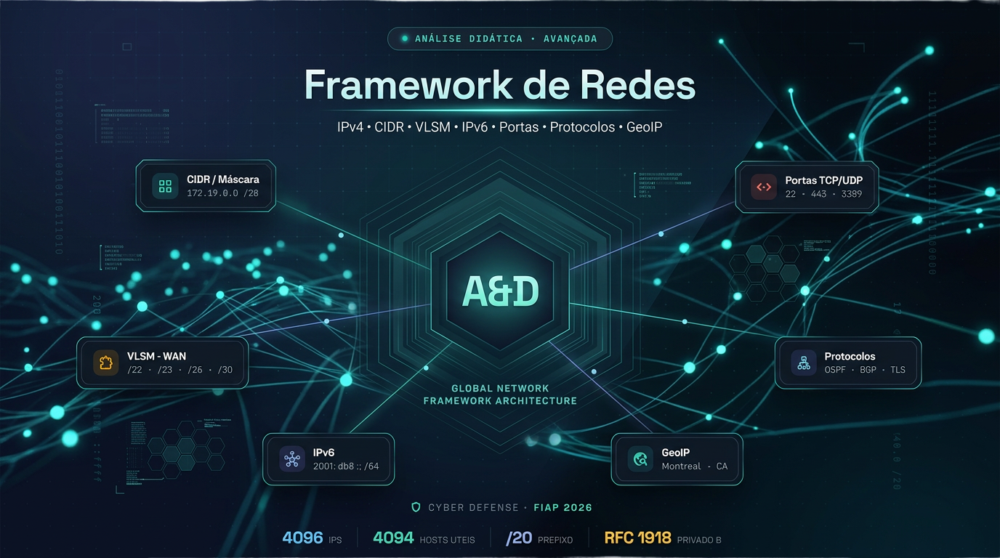
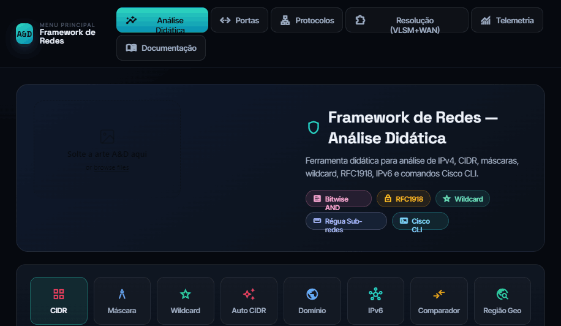
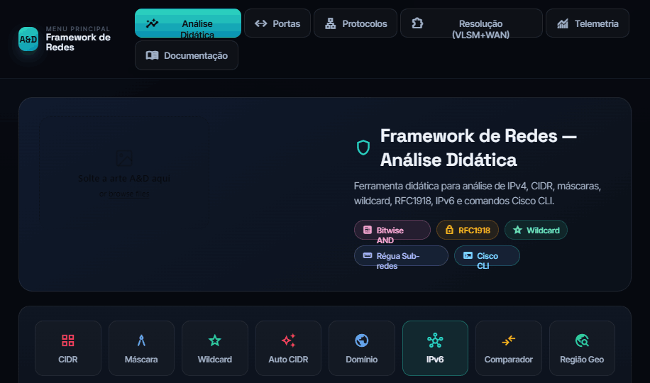
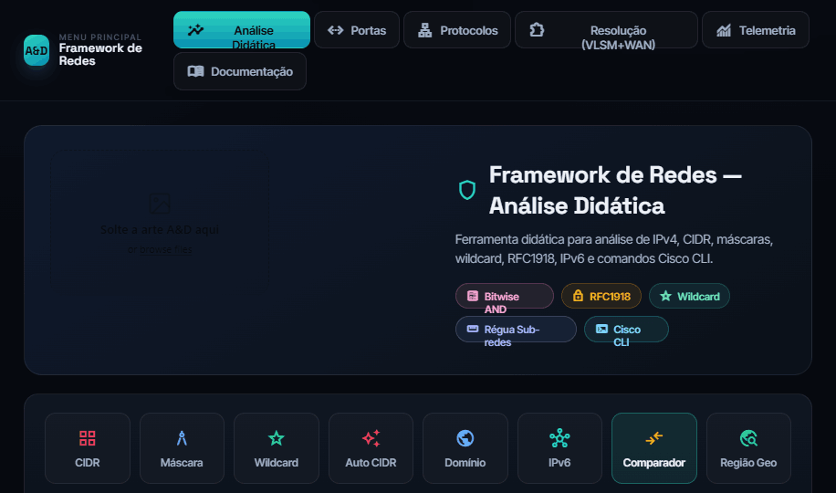
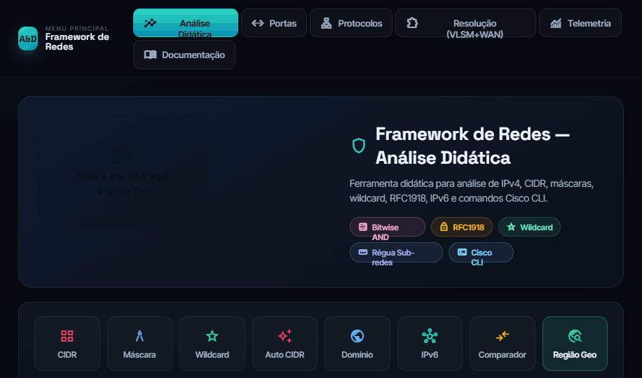
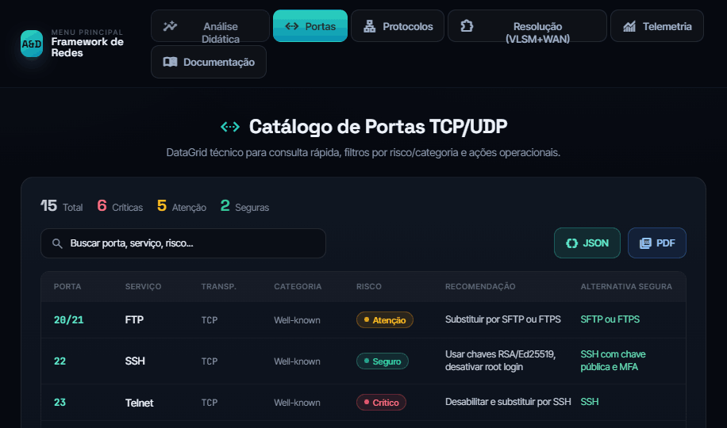
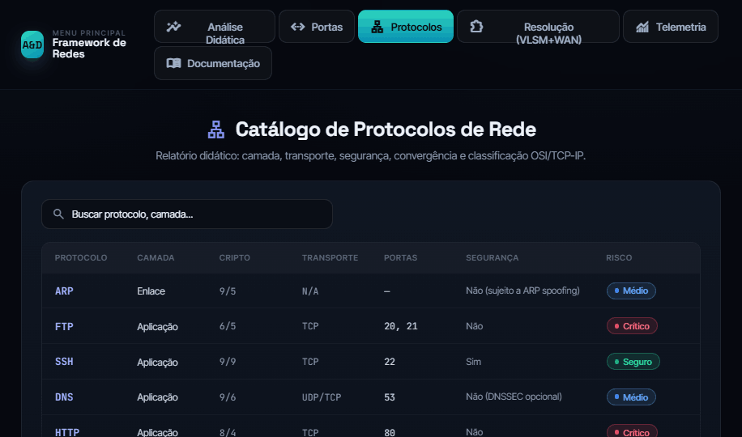
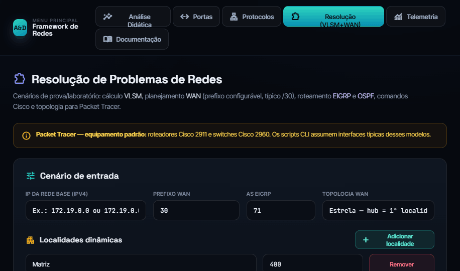
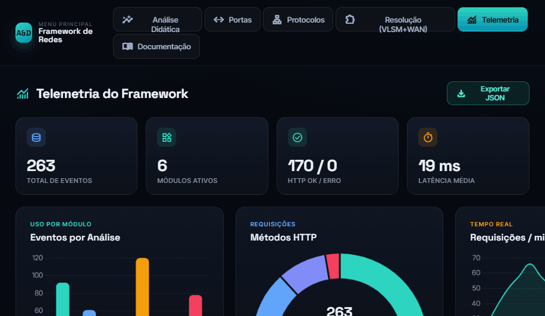
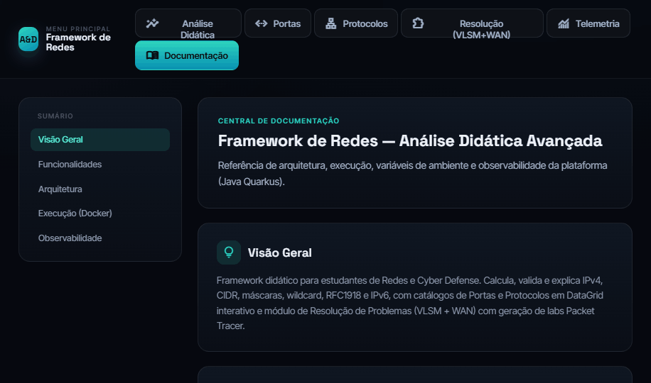

# Framework de Redes — Análise Didática Avançada (Java / Quarkus)

Ferramenta didática de redes migrada de **Python/Flask** para **Java 25 + Quarkus 3.37**, reorganizada como um **monólito modular** (*modular monolith*) — um único artefato de implantação com domínios autocontidos (*bounded contexts*), prontos para evoluir para microserviços.
Cobre análise de IPv4/IPv6, CIDR, máscaras, wildcard, VLSM, topologia WAN, scripts Cisco CLI, catálogos de portas/protocolos, GeoIP e telemetria.

[](https://openjdk.org/)
[](https://quarkus.io/)
[](https://www.docker.com/)
[](./LICENSE)



## Módulos

| Módulo | Rota | Descrição |
|--------|------|-----------|
| Início | `/` | Página inicial (landing) com visão geral e atalhos para os módulos |
| Análise Didática | `/analise` | CIDR, máscara, wildcard, auto-CIDR, domínio, IPv6, comparador |
| Localização | `/localizacao` | **GeoIP por IP** (região/ISP/risco, movido da Análise Didática) + **CEP** (ViaCEP) em mapa OpenStreetMap |
| Tráfego | `/trafego` | Dashboard de tráfego **ao vivo** (gráficos estilo Wireshark + Wi-Fi/Bluetooth, modo demo) e decodificador didático de pacotes (hex dump → Ethernet/IP/TCP/UDP/ICMP) |
| GeoIP (página) | `/informacoes` | Página autônoma de geolocalização de IP (MaxMind + fallback) |
| Portas | `/portas` | Catálogo interativo TCP/UDP |
| Protocolos | `/protocolos` | Catálogo + troubleshooting de roteamento |
| Resolução VLSM | `/resolucao-problemas` | Cenários VLSM/WAN, demos, exports e **ZIP da turma** |
| Telemetria | `/telemetria` | Dashboard de eventos e console ao vivo |
| Documentação | `/documentacao` | README técnico renderizado |
| Administração | `/admin/login` | Autenticação para rotas sensíveis (`/export/*`) |

## 📸 Telas do sistema

| Análise Didática (CIDR) | Análise IPv6 | Comparador de prefixos |
|:---:|:---:|:---:|
|  |  |  |
| **GeoIP / Região Geográfica** | **Catálogo de Portas** | **Catálogo de Protocolos** |
|  |  |  |
| **Resolução VLSM + WAN** | **Telemetria (OTLP/JSON)** | **Documentação** |
|  |  |  |

## Arquitetura

**Monólito modular** em Java 25 + Quarkus: implantação em um único artefato (fast-jar), com o código organizado por **domínios autocontidos**. Cada domínio de negócio (`analiseDidatica`, `portas`, `protocolos`, `resolucaoProblemas`) segue camadas `presentation → application → domain → infrastructure` (DDD-lite / hexagonal), e há módulos transversais (`security`, `telemetria`, `web`, `shared`). Endpoints em JAX-RS (`quarkus-rest`) e views em Qute.

Diagramas completos (filtros, VLSM, telemetria, `shared`, exceções e deploy Docker): veja `/documentacao` ou `src/main/resources/README.md`.

```text
org/framework/net/
├── analiseDidatica/     # presentation · application · domain/kernel · infrastructure (dns/geo/historico) · support
├── localizacao/         # presentation · application · infrastructure (ViaCEP · Nominatim/OSM)
├── analiseTrafego/      # presentation · application (decoder) · domain/model
├── portas/              # presentation · application · domain · exception
├── protocolos/          # presentation · application · domain · exception
├── resolucaoProblemas/  # presentation · application (export/importing/normalization/planning/routing) · domain (kernel/model)
├── security/            # Admin API key · CSRF · rate limit · sensitive APIs
├── telemetria/          # store · dashboard · filter · presentation
├── shared/              # sanitizers · guards · normalizadores de entrada
└── web/                 # home (landing) · documentacao · admin login · ícone · filtros
```

Os **estáticos** seguem a mesma divisão por módulo dos templates Qute: cada página com estilo próprio tem seu CSS na pasta do módulo (`home/css/`, `portas/css/`, `protocolos/css/`, `telemetria/css/`, `resolucaoProblemas/css/`, `documentacao/css/`), enquanto o **design system compartilhado** (casca, nav, cards, botões, tokens) fica em `web/css/app.css` + `web/css/aed-command-center.css`, carregado por `shared/base.html`.

## Requisitos

- JDK **25**
- Gradle (wrapper incluído)
- Docker (opcional, para deploy)

## Desenvolvimento

```powershell
cd D:\PROJETOS-OPEN\framework-net-java-quarkus
.\gradlew.bat quarkusDev
```

Aplicação em `http://localhost:8080`. Em modo dev o navegador abre automaticamente (`%dev.framework.dev.open-browser=true`).

## Testes

```powershell
.\gradlew.bat test
```

Suíte em JUnit 5 + RestAssured, em `src/test/java`.

## Docker (VPS)

```powershell
docker compose -f docker-compose.yml up -d --build
```

Perfil `prod`: proxy reverso habilitado, dados persistentes em `/deployments/data`.
**Obrigatório** definir `ADMIN_API_KEY` e `CSRF_SECRET` (veja `.env.example`).

## Configuração

Principais chaves (`application.properties` / `application-prod.properties`), sobrescritíveis por ambiente:

| Chave / Env | Padrão | Descrição |
|-------------|--------|-----------|
| `HTTP_PORT` / `quarkus.http.port` | `8080` | Porta HTTP |
| `ADMIN_API_KEY` | — | Chave admin (obrigatória em prod) |
| `CSRF_SECRET` | — | Segredo CSRF (obrigatório em prod) |
| `GEO_DB_HOST_PATH` | — | Caminho do `GeoLite2-City.mmdb` (opcional) |
| `framework.dns.cache-ttl-seconds` | `180` | TTL do cache DNS |
| `framework.telemetry.max-events` | `5000` | Eventos em buffer da telemetria |
| `framework.security.rate-limit-per-minute` | `120` | Rate limit geral |
| `framework.security.cookie-secure` | `false` (dev) / `true` (prod) | Marca cookies CSRF/admin como `Secure` (HTTPS) |

## Segurança

- Chave administrativa protege o prefixo `/export` (header `X-Admin-Api-Key` ou login em `/admin/login`), com comparação em tempo constante.
- Proteção CSRF (double-submit + HMAC), rate limiting (com limpeza periódica dos buckets) e headers HTTP de segurança (`X-Content-Type-Options`, `X-Frame-Options`, `Referrer-Policy`, `Permissions-Policy`).
- Cookies `HttpOnly` + `SameSite`; marque `framework.security.cookie-secure=true` atrás de HTTPS (padrão no perfil `prod`).

## Telemetria (observabilidade)

O dashboard vive em `/telemetria`. Os artefatos **compartilháveis** seguem o padrão **OpenTelemetry OTLP/JSON** (Logs Data Model): `logs/telemetria_compartilhada.json` (documento `LogsData`), `logs/framework-net-eventos.jsonl` (um `LogRecord` OTLP por linha) e o download em `GET /telemetria/api/exportar`. Detalhes em `src/main/resources/README.md` ou `/documentacao`.

## Exportações — Resolução de Problemas

| Ação | Arquivo |
|------|---------|
| `export` | `config_packet_tracer_consolidado.txt` |
| `export_zip` | `laboratorio_packet_tracer.zip` |
| `export_entrega` | `documentacao_cenario_rede.txt` |
| `export_class_zip` | `pacote_turma_packet_tracer.zip` (`por_aluno/<aluno>/`) |

### Importar turma (Excel)

Cole na página Resolução (TAB entre colunas):

```
Nome | Rede base | Hosts1 | Hosts2
```

## Documentação

A documentação técnica completa fica em `src/main/resources/README.md` e é renderizada na própria aplicação em `/documentacao`.

## Autor

Paulo André Carminati — RM570877 — FIAP 2026 — Cyber Defense

Repositório: [github.com/carmipa/framework-net-java-quarkus](https://github.com/carmipa/framework-net-java-quarkus)

## Licença

MIT.
