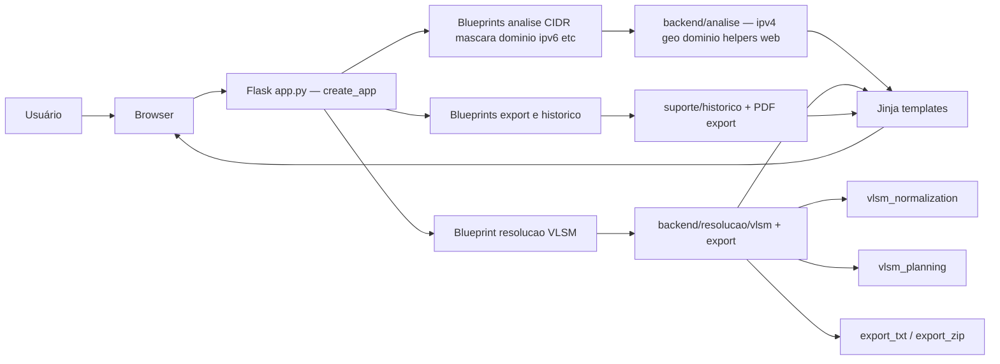
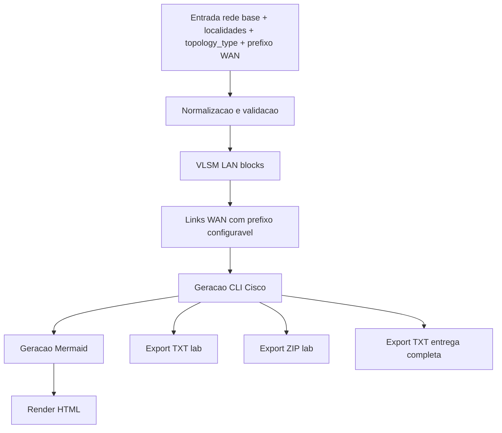
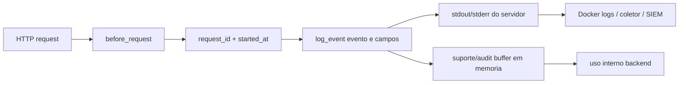

# 🛡️ Framework de Redes - Análise Didática Avançada

> **Versão Java/Quarkus** (`framework-net-java-quarkus`) — Java 25 + Quarkus 3.37.  
> Migração do projeto Python/Flask. Documentação renderizada em `/documentacao`.

[](https://openjdk.org/)
[](https://quarkus.io/)
[](https://www.docker.com/)
[](#)
[](./LICENSE)

<p align="center">
  
</p>

Aplicação didática em **Java/Quarkus** para análise de redes, com dois módulos principais:

- `Análise Didática`: CIDR, máscara, wildcard, DNS, IPv6, comparador, portas e protocolos.
- `Resolução de Problemas`: VLSM dinâmico para N localidades, topologia WAN (estrela / estrela estendida / malha), CLI Cisco e exportação para laboratório.

> Repositório: [https://github.com/carmipa/FRAMEWORK_DE_REDES_ANALISE_DIDATICA_AVANCADA](https://github.com/carmipa/FRAMEWORK_DE_REDES_ANALISE_DIDATICA_AVANCADA)

---

## 📚 Sumário

- Visão geral
- Funcionalidades
- Arquitetura
- Execução local e Docker
- Variáveis de ambiente
- Logging e observabilidade (server-side)
- Documentação do projeto
- Estrutura de pastas
- Testes
- Roadmap

---

## 🎯 Visão Geral

O framework cobre fluxo didático completo para aula, laboratório e revisão técnica:

- cálculo de rede/broadcast/hosts úteis;
- decomposição binária e tabela AND por octeto;
- conversão entre CIDR, máscara e wildcard;
- resolução DNS com cache e timeout;
- classificação e contexto de risco/GRC;
- geração automática de cenário de laboratório (VLSM, links WAN com prefixo configurável, CLI e exportação para laboratório ou entrega em um único `.txt`).

---

## 🚀 Funcionalidades

### Módulo 1 - Análise Didática

- `CIDR`: IP + /barra.
- `Máscara`: decomposição por máscara decimal.
- `Wildcard`: engenharia reversa com base ACL/OSPF.
- `Auto CIDR`: inferência didática por IP.
- `Domínio`: hostname/URL -> DNS -> análise.
- `IPv6`: visão básica com resumo técnico.
- `Comparador`: comparação lado a lado entre dois prefixos.
- `Portas` e `Protocolos`: catálogo didático com filtros, resumo IGP/EGP e bloco **Troubleshooting rápido (roteamento)** após a grelha principal.

### Módulo 2 - Resolução de Problemas (VLSM + WAN)

Guia completo: [`documentacao/GUIA_RESOLUCAO_PROBLEMAS.md`](documentacao/GUIA_RESOLUCAO_PROBLEMAS.md)

- entrada dinâmica com N localidades (nome + **quantidade de hosts** — o sistema calcula o CIDR; fórmula `2^H ≥ N+2` → prefixo `32−H`);
- **obrigatório:** IP/rede base e localidades; **opcional:** CIDR da base (inferência classful se vazio), AS EIGRP (padrão `71`), processo OSPF (padrão `1`);
- **Prefixo WAN** configurável (padrão `/30` para enlaces ponto a ponto);
- topologias WAN: `star`, `extended_star` (FIAP 4 sites) ou `mesh`;
- roteamento **EIGRP/OSPF** por distribuição (`eigrp_only`, `ospf_only`, metade/metade, `auto`);
- acesso remoto VTY: **Telnet** (padrão, com `transport input telnet`), SSH ou ambos;
- diagrama Mermaid interativo (clique em nós LAN/WAN);
- demos na URL: `?demo=gs` (Global Solution Mazola 900/700/750), `?demo=fiap`, `?demo=8`, `?demo=1`;
- exportações **após calcular** (recalculam o cenário e baixam o arquivo):
  - **Lab (.txt)** — scripts IOS consolidados;
  - **Lab (.zip)** — guia de montagem, configs por roteador, Mermaid, README;
  - **Entrega (.txt)** — relatório completo para disciplina (`documentacao_cenario_rede.txt`).

---

## 🏗️ Arquitetura

### Arquitetura geral da aplicação



### Testes automatizados

Na raiz do projeto:

```powershell
.\scripts\run_tests.ps1
```

Ou:

```bash
python -m pip install -r requirements.txt
python -m unittest discover -s tests -p "test_*.py" -v
```

| Arquivo | Tipo | Cobertura |
|---------|------|-----------|
| `tests/test_vlsm_planning_unit.py` | Unitário | Topologias WAN, prefixos, pares de links |
| `tests/test_vlsm_unit.py` | Unitário | `solve_network_problem`, EIGRP, CLI, Mermaid |
| `tests/test_resolucao_integracao.py` | Integração | HTTP `/resolucao-problemas`, exports, cenário FIAP |
| `tests/test_app.py` | Integração | App Flask (CIDR, resolução, ZIP, etc.) |
| `tests/test_cobertura_extra.py` | Integração | Rotas auxiliares e exportações |

### Fluxo do módulo de resolução VLSM/WAN



### Fluxo de logging server-side (sem tela de logs)



---

## ▶️ Execução

### Docker (recomendado)

```bash
docker compose up --build
```

Acesse: [http://127.0.0.1:5000](http://127.0.0.1:5000)

Parar:

```bash
docker compose down
```

### Java / Quarkus local

Windows PowerShell:

```powershell
.\gradlew.bat quarkusDev
```

Linux/macOS:

```bash
./gradlew quarkusDev
```

Aplicação em `http://localhost:8080`. Testes: `.\gradlew.bat test` (Windows) ou `./gradlew test`.

> O projeto Python/Flask original permanece no repositório de migração; este módulo é **Java/Quarkus**.

---

## ⚙️ Variáveis de Ambiente

- `APP_HOST` (padrão `127.0.0.1`)
- `APP_PORT` (padrão `5000`)
- `APP_DEBUG` (padrão `true`)
- `APP_OPEN_BROWSER` (padrão `true`)
- `APP_LOG_LEVEL` (padrão `INFO`)
- `APP_LOG_COLOR` (padrão `1`) ativa cor no console quando houver suporte a TTY
- `APP_LOG_FORCE_COLOR` (padrão `1`) força cor mesmo sem TTY (útil em Docker/VPS)
- `DNS_CACHE_TTL_SECONDS` (padrão `180`)
- `DNS_RESOLVE_TIMEOUT_SECONDS` (padrão `3.0`)
- `APP_AUDIT_LOG_LIMIT` (padrão `400`)

Exemplo:

```bash
APP_HOST=0.0.0.0 APP_PORT=5000 APP_DEBUG=false APP_LOG_LEVEL=INFO APP_LOG_COLOR=1 APP_LOG_FORCE_COLOR=1 APP_AUDIT_LOG_LIMIT=800 python app.py
```

---

## 📋 Logging e Observabilidade (Server-Side)

O logging é orientado a servidor e não possui tela dedicada na interface do usuário.

Implementado:

- timestamps em UTC (`Z`);
- `request_id` por requisição;
- eventos estruturados (`evento=...`, `status=...`, `modo=...`);
- logs de uso com motivo (`reason`) para trilha operacional;
- `before_request` e `after_request` para ciclo completo;
- logs de erro com stack trace apenas no backend;
- mensagens seguras no frontend sem exposição de detalhes internos.

Coleta recomendada em produção:

- `docker logs` / `compose logs`;
- agregador central (ELK, Loki, Datadog, Splunk, SIEM).

---

## 📁 Documentação do Projeto

Os documentos de análise, padrões e guias de apoio ficam centralizados em:

- `documentacao/`

Principais arquivos:

- `documentacao/GUIA_RESOLUCAO_PROBLEMAS.md` — VLSM, WAN, exports, demos, Telnet, FIAP/GS
- `documentacao/DOCUMENTACAO_TECNICA_ATUALIZADA.md`
- `documentacao/ANALISE_VLSM_WAN.md`
- `documentacao/ANALISE_LOGS_EXCECOES.md`
- `documentacao/PADROES_EXCECOES.md`
- `documentacao/EXEMPLOS_REFATORACAO.md`
- `documentacao/CHECKLIST_CONFORMIDADE_UX_TOOLTIPS.md`

---

## 🗂️ Estrutura de Pastas

```text
FRAMEWORK_DE_REDES_ANALISE_DIDATICA_AVANCADA/
├── app.py                 # create_app() e run_dev()
├── backend/
│   ├── config.py
│   ├── core/              # exceções, logging, helpers
│   ├── web/               # rotas da home, ícone, páginas estáticas
│   ├── analise/           # CIDR, máscara, domínio, IPv6, geo, portas, protocolos…
│   ├── resolucao/         # VLSM/WAN, exportação TXT/ZIP/PDF
│   └── suporte/           # histórico, GRC, auditoria em memória
├── documentacao/          # análises, padrões e guias técnicos
├── templates/
├── static/css/app.css
├── tests/test_app.py
├── Dockerfile
├── docker-compose.yml
└── requirements.txt
```

---

## ✅ Testes

Executar suíte:

```bash
python -m pytest -q
```

A suíte cobre:

- validações dos modos principais;
- resolução de problemas com múltiplas localidades e cenário Mazola GS (`/22`, Telnet);
- topologias WAN estrela, estrela estendida e malha;
- exportações laboratório (`.txt`, `.zip`) e entrega acadêmica (`.txt`);
- regressões de comportamento e renderização crítica.

> O relatório único de entrega (`export_entrega` → `documentacao_cenario_rede.txt`) pode ser validado manualmente após o cálculo do cenário na interface.

---

## 🧹 Clean Code Aplicado

O projeto adota funções puras e módulos por responsabilidade (sem classes para regras de domínio).

- `backend/resolucao/vlsm/vlsm_service.py` orquestra o fluxo VLSM/WAN.
- Normalização, planeamento e exportação ficam em `vlsm_normalization.py`, `vlsm_planning.py` e `backend/resolucao/export/`.
- Helpers da camada web da página inicial: `backend/analise/home_web_helpers.py` (reexportados por `helpers_web.py` onde aplicável).

Esse desenho reduz acoplamento e facilita manutenção incremental.

---

## 🛣️ Roadmap

- [x] VLSM dinâmico para N localidades
- [x] topologia WAN estrela / estrela estendida / malha
- [x] EIGRP + OSPF (distribuição por site, AS/processo opcionais)
- [x] Telnet explícito nos scripts (`transport input telnet`)
- [x] demo Global Solution Mazola (`?demo=gs`)
- [x] geração CLI Cisco + export laboratório
- [x] prefixo WAN configurável (separado do CIDR da rede base)
- [x] CIDR da rede base opcional com inferência didática pelo IP
- [x] exportação texto único para entrega acadêmica (`documentacao_cenario_rede.txt`)
- [x] logging estruturado com `request_id` e UTC
- [x] responsividade geral da interface
- [ ] persistência externa de logs operacionais (arquivo/stack observabilidade)
- [ ] filtros avançados de histórico por período e modo

---

## 👨‍💻 Autor

Paulo André Carminati | RM570877 | FIAP 2026 | CyberSegurança

---

## 📄 Licença

MIT.
