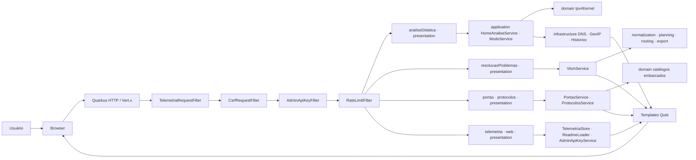
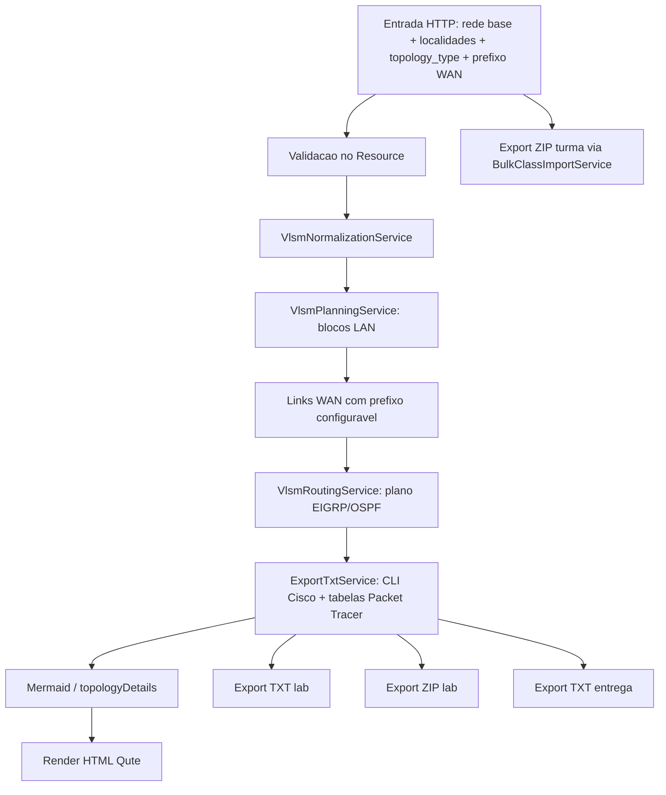
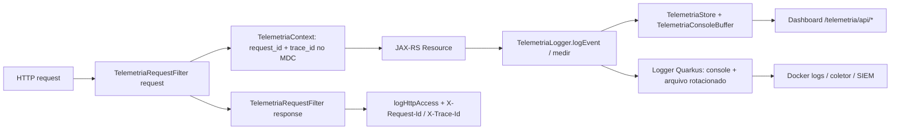
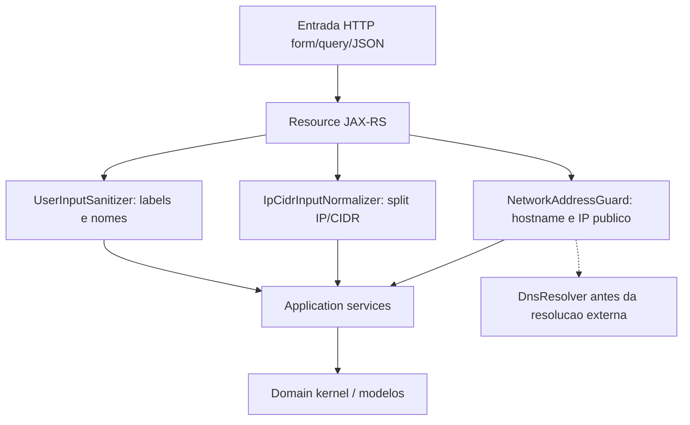
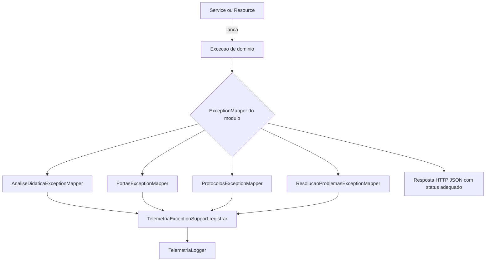
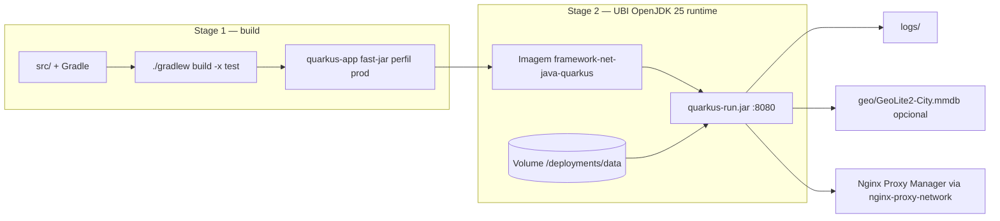

# 🛡️ Framework de Redes - Análise Didática Avançada

> **Versão Java/Quarkus** (`framework-net-java-quarkus`) — Java 25 + Quarkus 3.37.
> Migração do projeto original Python/Flask. Esta documentação é renderizada dentro da própria aplicação em `/documentacao`.

<p align="center">
  
</p>

Aplicação didática para análise de redes IPv4/IPv6, com foco em ensino, laboratório e revisão técnica. Originalmente escrita em **Python/Flask**, foi **migrada para Java 25 + Quarkus** e reorganizada como um **monólito modular** (*modular monolith*): um único artefato de implantação com domínios autocontidos, prontos para evoluir para microserviços. Reúne seis módulos:

- **Análise Didática** — CIDR, máscara, wildcard, auto-CIDR, domínio (DNS), IPv6, comparador e GeoIP.
- **Portas** — catálogo interativo de portas TCP/UDP.
- **Protocolos** — catálogo de protocolos + troubleshooting de roteamento.
- **Resolução de Problemas (VLSM + WAN)** — planejamento VLSM dinâmico, topologia WAN, CLI Cisco e exportação para laboratório.
- **Telemetria** — dashboard de eventos e console ao vivo (server-side).
- **Documentação** — este README renderizado.

> Repositório: [https://github.com/carmipa/framework-net-java-quarkus](https://github.com/carmipa/framework-net-java-quarkus)

---

## 📚 Sumário

- Visão geral
- Módulos e rotas
- Funcionalidades
- Arquitetura (geral, VLSM, telemetria, shared, exceções, deploy Docker)
- Requisitos
- Execução local e Docker
- Variáveis de configuração
- Segurança
- Telemetria e observabilidade
- Estrutura de pastas
- Testes
- Roadmap

---

## 🎯 Visão Geral

O framework cobre um fluxo didático completo para aula, laboratório e revisão técnica:

- cálculo de rede/broadcast/hosts úteis;
- decomposição binária e tabela AND por octeto;
- conversão entre CIDR, máscara e wildcard;
- resolução de domínio (DNS) com cache e timeout;
- geolocalização de IP (GeoIP MaxMind, opcional);
- classificação e contexto de risco/GRC;
- geração automática de cenário de laboratório (VLSM, links WAN com prefixo configurável, CLI Cisco e exportação para laboratório ou entrega acadêmica em `.txt`/`.zip`).

---

## 🧭 Módulos e Rotas

| Módulo | Rota | Método | Descrição |
|--------|------|--------|-----------|
| Início | `/` | GET | Página inicial (landing) com atalhos para os módulos |
| Análise Didática | `/analise` | GET/POST | CIDR, máscara, wildcard, auto-CIDR, domínio, IPv6, comparador (parâmetro `?tab=`) |
| Localização | `/localizacao` | GET | Localização por IP e por CEP no mapa |
| Localização (API) | `/localizacao/api/ip`, `/localizacao/api/cep` | GET | JSON: geolocalização por IP / endereço por CEP (ViaCEP + OSM) |
| Tráfego | `/trafego` | GET | Decodificador didático de pacotes (hex dump) |
| Tráfego (API) | `/trafego/api/decodificar` | POST | JSON: camadas Ethernet/IP/TCP/UDP/ICMP decodificadas |
| GeoIP | `/informacoes` | GET | Página de geolocalização (`?ip=`) |
| GeoIP (API) | `/api/informacoes/geo` | GET | JSON de geolocalização (`?ip=`) |
| Referência de máscaras | `/mascara-referencia` | GET | Tabela JSON de máscaras/prefixos |
| Portas | `/portas` | GET | Catálogo interativo TCP/UDP |
| Protocolos | `/protocolos` | GET | Catálogo + troubleshooting de roteamento |
| Resolução VLSM | `/resolucao-problemas` | GET/POST | Cenários VLSM/WAN, demos e exportações |
| Telemetria | `/telemetria` | GET | Dashboard de eventos e console |
| Telemetria (API) | `/telemetria/api/*` | GET/POST | `resumo`, `dashboard`, `console`, `console/limpar`, `exportar`, `pasta` |
| Documentação | `/documentacao` | GET | Este README renderizado |
| Histórico (API) | `/history` | GET | Lista o histórico em JSON |
| Histórico catálogo | `/history/catalog` | POST | Registra consulta de portas/protocolos |
| Exportação análise | `/export/json`, `/export/pdf` | GET | 🔒 Protegido por chave administrativa |
| Login administrativo | `/admin/login`, `/admin/logout` | GET/POST | Autenticação para rotas sensíveis |

---

## 🚀 Funcionalidades

### Módulo 1 — Análise Didática (`/`)

Selecionável via `?tab=` (ou pelas abas da interface):

- `cidr` — IP + `/barra`;
- `mask` — decomposição por máscara decimal;
- `wildcard` — engenharia reversa com base ACL/OSPF;
- `autoip` — inferência didática de CIDR pelo IP;
- `dominio` — hostname/URL → DNS → análise;
- `ipv6` — visão básica com resumo técnico;
- `comparador` — comparação lado a lado entre dois prefixos.

Recursos de apoio: geolocalização (`/informacoes`), tabela de referência de máscaras (`/mascara-referencia`), histórico paginado e exportações (`/export/json`, `/export/pdf`).

### Módulo 2 — Portas (`/portas`) e Protocolos (`/protocolos`)

- catálogo didático com filtros;
- resumo IGP/EGP e bloco **Troubleshooting rápido (roteamento)** na página de protocolos;
- registro opcional das consultas no histórico via `/history/catalog`.

### Módulo 3 — Resolução de Problemas (VLSM + WAN) (`/resolucao-problemas`)

- entrada dinâmica com N localidades (nome + **quantidade de hosts** — o sistema calcula o CIDR pela fórmula `2^H ≥ N+2` → prefixo `32−H`);
- **obrigatório:** IP/rede base e localidades; **opcional:** CIDR da base (inferência classful se vazio), AS EIGRP (padrão `71`), processo OSPF (padrão `1`);
- **prefixo WAN** configurável (padrão `/30` para enlaces ponto a ponto, faixa `0–30`);
- topologias WAN: `star`, `extended_star`, `mesh`, `ring` e `ring_redundant` (aceita também os aliases `estrela` e `estrela_estendida`);
- roteamento **EIGRP/OSPF** por distribuição (`eigrp_only`, `ospf_only`, metade/metade, `auto`);
- acesso remoto VTY: **Telnet** (padrão, com `transport input telnet`), SSH ou ambos;
- diagrama de topologia interativo no navegador;
- demos na URL: `?demo=gs` (Global Solution Mazola), `?demo=fiap`, `?demo=8`, `?demo=1`;
- exportações **após calcular** (recalculam o cenário e baixam o arquivo).

#### Exportações

| Ação (`action_type`) | Arquivo | Conteúdo |
|----------------------|---------|----------|
| `export` | `config_packet_tracer_consolidado.txt` | scripts IOS consolidados |
| `export_zip` | `laboratorio_packet_tracer.zip` | guia de montagem, configs por roteador, README |
| `export_entrega` | `documentacao_cenario_rede.txt` | relatório completo para disciplina |
| `export_class_zip` | `pacote_turma_packet_tracer.zip` | pacote por aluno (`por_aluno/<aluno>/`) |

#### Importar turma (Excel)

Cole na página de Resolução (TAB entre colunas):

```
Nome | Rede base | Hosts1 | Hosts2
```

---

## 🏗️ Arquitetura

Estilo arquitetural: **monólito modular** (*modular monolith*) em **Java 25 + Quarkus**, migrado do projeto original em Python/Flask. A aplicação é implantada como **um único artefato** (Quarkus fast-jar), mas o código é organizado por **domínios autocontidos** (*bounded contexts*) — cada módulo funciona como um "microserviço interno", com fronteiras claras e baixo acoplamento, pronto para ser extraído para um serviço independente caso o projeto evolua nesse sentido.

- **Runtime único**: endpoints **JAX-RS** (`quarkus-rest`) e views em **Qute** (`quarkus-rest-qute`) sobre `quarkus-vertx-http`.
- **Módulos de domínio**: `analiseDidatica`, `portas`, `protocolos`, `resolucaoProblemas`.
- **Módulos transversais**: `security` (CSRF, rate limit, chave admin), `telemetria` (observabilidade), `web` (documentação, login, ícone) e `shared` (sanitização e utilitários de entrada).

### Camadas por módulo (organização DDD-lite / hexagonal)

Cada domínio de negócio segue a mesma separação de responsabilidades:

| Camada | Responsabilidade | Exemplos |
|--------|------------------|----------|
| `presentation` | Endpoints JAX-RS (`@Path`) e binding com templates Qute | `AnaliseDidaticaResource`, `ResolucaoProblemasResource` |
| `application` | Casos de uso / serviços de orquestração | `HomeAnaliseService`, `VlsmService`, `export/`, `planning/`, `routing/` |
| `domain` | Regras de negócio puras (kernel + modelos) | `Ipv4Kernel`, `domain/model` |
| `infrastructure` | Integrações externas e persistência | `dns/`, `geo/` (MaxMind), `historico/` |
| `support` / `config` / `exception` | Apoio à UI, configuração e mapeamento de erros | `AnaliseDidaticaUiSupport`, `DnsConfig`, `*ExceptionMapper` |



Ordem real dos filtros JAX-RS (prioridade): `TelemetriaRequestFilter` → `CsrfRequestFilter` → `AdminApiKeyFilter` → `RateLimitFilter` → Resource.

Módulos em `presentation`:

| Pacote | Resources principais |
|--------|----------------------|
| `analiseDidatica` | `/`, `/informacoes`, `/api/informacoes/geo`, `/mascara-referencia`, `/history`, `/export/*` |
| `resolucaoProblemas` | `/resolucao-problemas` |
| `portas` / `protocolos` | `/portas`, `/protocolos` |
| `telemetria` | `/telemetria`, `/telemetria/api/*` |
| `web` | `/documentacao`, `/admin/*`, `/icone.png` |

### Fluxo do módulo VLSM/WAN



### Fluxo de telemetria (server-side)



### Utilitários transversais (`shared`)

Entrada do usuário passa por utilitários compartilhados **antes** dos services de domínio, reduzindo risco de injeção, IPs privados/reservados e formatos inválidos.



| Classe | Uso principal |
|--------|----------------|
| `UserInputSanitizer` | Nomes de localidade, roster da turma, labels Mermaid |
| `IpCidrInputNormalizer` | Separação e normalização de IP + CIDR na análise e resolução |
| `NetworkAddressGuard` | Bloqueio de hostnames reservados e endereços não públicos no DNS |

### Tratamento de exceções (`ExceptionMapper`)

Cada módulo de domínio possui um `@Provider` JAX-RS que converte exceções tipadas em respostas HTTP seguras e registra o evento na telemetria.



| Mapper | Exceção | Status típico |
|--------|---------|---------------|
| `AnaliseDidaticaExceptionMapper` | `EntradaInvalidaException` | `400` |
| `AnaliseDidaticaExceptionMapper` | `DnsResolucaoException` | `500` |
| `PortasExceptionMapper` | `PortasException` | conforme tipo |
| `ProtocolosExceptionMapper` | `ProtocolosException` | conforme tipo |
| `ResolucaoProblemasExceptionMapper` | `EntradaInvalidaException` / `ResolucaoProblemasException` | `400` / `500` |

> Páginas HTML (Qute) tratam erros de validação inline no Resource (`erro` + `invalidFields` no template), sem passar pelo mapper — os mappers cobrem principalmente respostas JSON e falhas de domínio não capturadas.

### Deploy Docker (build multi-stage → runtime)



| Etapa | Detalhe |
|-------|---------|
| **Build** | `eclipse-temurin:25-jdk-noble` → `./gradlew build -x test` com `-Dquarkus.package.jar.type=fast-jar -Dquarkus.profile=prod` |
| **Runtime** | `registry.access.redhat.com/ubi9/openjdk-25-runtime` — usuário `185`, healthcheck em `/` |
| **Volume** | `framework-net-data:/deployments/data` — logs, GeoIP e dados da aplicação |
| **Env obrigatórias (prod)** | `ADMIN_API_KEY`, `CSRF_SECRET`, `QUARKUS_PROFILE=prod` |
| **Rede (VPS)** | `nginx-proxy-network` (externa) + bind `127.0.0.1:${HTTP_PORT}:8080` |
| **Dev Docker** | `docker-compose.dev.yml` — dados em `./docker-data`, porta padrão `8081` |

---

## ✅ Requisitos

- **JDK 25**
- Gradle (wrapper incluído — `gradlew` / `gradlew.bat`)
- Docker (opcional, para deploy)

Dependências principais (`build.gradle`): `quarkus-rest`, `quarkus-rest-jackson`, `quarkus-rest-qute`, `quarkus-qute`, `quarkus-cache`, `quarkus-vertx-http`, `com.github.seancfoley:ipaddress:5.5.1`, `com.maxmind.geoip2:geoip2:4.2.0`.

---

## ▶️ Execução

### Java / Quarkus local

Windows PowerShell:

```powershell
.\gradlew.bat quarkusDev
```

Linux/macOS:

```bash
./gradlew quarkusDev
```

Aplicação em `http://localhost:8080`. Em modo dev, o navegador abre automaticamente quando `%dev.framework.dev.open-browser=true`.

### Docker (VPS)

```bash
docker compose -f docker-compose.yml up -d --build
```

O perfil `prod` (`QUARKUS_PROFILE=prod`) habilita proxy reverso e grava dados persistentes em `/deployments/data`. É **obrigatório** definir `ADMIN_API_KEY` e `CSRF_SECRET` (ver `.env.example` / `docker-compose.yml`).

Parar:

```bash
docker compose -f docker-compose.yml down
```

---

## ⚙️ Variáveis de Configuração

As chaves são definidas em `application.properties` (dev) e `application-prod.properties` (deploy), podendo ser sobrescritas por variáveis de ambiente.

### Aplicação

| Propriedade | Padrão | Descrição |
|-------------|--------|-----------|
| `quarkus.http.port` | `8080` | Porta HTTP |
| `quarkus.http.host` | `0.0.0.0` | Host de bind |
| `framework.app.max-history` | `60` | Tamanho máximo do histórico |
| `framework.app.comparador-cidr-padrao-a` | `20` | CIDR padrão do comparador (A) |
| `framework.app.comparador-cidr-padrao-b` | `24` | CIDR padrão do comparador (B) |
| `framework.dns.cache-ttl-seconds` | `180` | TTL do cache DNS |
| `framework.dns.resolve-timeout-seconds` | `3` | Timeout de resolução DNS |
| `framework.geo.cache-ttl-seconds` | `300` | TTL do cache GeoIP |
| `framework.geo.database-path` | `geo/GeoLite2-City.mmdb` | Base MaxMind (opcional) |
| `framework.dev.open-browser` | `true` (dev) | Abre navegador no `quarkusDev` |

### Telemetria

| Propriedade | Padrão | Descrição |
|-------------|--------|-----------|
| `framework.logs.base-dir` | `logs` | Pasta de logs/exportações |
| `framework.telemetry.enabled` | `true` | Habilita coleta |
| `framework.telemetry.dashboard-enabled` | `true` | Habilita a página `/telemetria` |
| `framework.telemetry.max-events` | `5000` | Eventos em buffer |

### Segurança

| Propriedade | Padrão (dev) | Descrição |
|-------------|--------------|-----------|
| `framework.security.csrf-enabled` | `true` | Proteção CSRF |
| `framework.security.csrf-secret` | *(dev)* | Segredo do token CSRF — **trocar em prod** (`CSRF_SECRET`) |
| `framework.security.sensitive-apis-enabled` | `true` | Habilita APIs sensíveis |
| `framework.security.rate-limit-enabled` | `true` | Habilita rate limiting |
| `framework.security.rate-limit-per-minute` | `120` | Limite geral por minuto |
| `framework.security.rate-limit-heavy-per-minute` | `30` | Limite de rotas pesadas |
| `framework.security.admin-api-key` | *(dev)* | Chave admin — em prod via `ADMIN_API_KEY` |
| `framework.security.admin-api-key-required` | `true` | Exige chave nas rotas protegidas |

### Variáveis de ambiente (deploy Docker)

- `HTTP_PORT` (padrão `8080`) — porta publicada no host;
- `ADMIN_API_KEY` — **obrigatória** em prod;
- `CSRF_SECRET` — **obrigatória** em prod;
- `GEO_DB_HOST_PATH` — caminho do `GeoLite2-City.mmdb` no host (opcional);
- `QUARKUS_PROFILE=prod`.

---

## 🔐 Segurança

- **Chave administrativa** — rotas sob o prefixo `/export` são protegidas. O acesso é liberado por:
  - header `X-Admin-Api-Key: <chave>`, **ou**
  - cookie `ADMIN_API_KEY` obtido via login em `/admin/login`.
  - A exigência só é ativada quando `admin-api-key-required=true` **e** a chave está configurada; a comparação usa tempo constante.
- **CSRF** — filtros de request/response emitem e validam token para operações sensíveis.
- **Rate limiting** — limites por minuto configuráveis (geral e rotas pesadas).
- **Headers HTTP de segurança** — `X-Content-Type-Options: nosniff`, `X-Frame-Options: SAMEORIGIN`, `Referrer-Policy: strict-origin-when-cross-origin`, `Permissions-Policy` restritiva.
- **Sanitização de entrada** — `UserInputSanitizer`, `IpCidrInputNormalizer` e `NetworkAddressGuard` no pacote `shared`.

---

## 📋 Telemetria e Observabilidade (Server-Side)

A telemetria é orientada a servidor e possui dashboard próprio em `/telemetria`.

Implementado:

- `request_id` e `trace_id` por requisição (via `TelemetriaRequestFilter` + MDC);
- eventos estruturados (`TelemetriaLogger.logEvent` / `logException`);
- buffer em memória + arquivo compartilhado (`TelemetriaStore`);
- console ao vivo e exportação JSON (`/telemetria/api/exportar`);
- logs em console e arquivo com rotação (`quarkus.log.file.*`).

### Formato de compartilhamento: OpenTelemetry OTLP/JSON

Os artefatos compartilháveis seguem o **[OpenTelemetry Logs Data Model](https://opentelemetry.io/docs/specs/otel/logs/data-model/)** serializado em **OTLP/JSON** — o padrão da indústria para interoperar telemetria com Grafana, Loki, Jaeger, Datadog, SIEMs, etc.

| Artefato | Formato | Descrição |
|----------|---------|-----------|
| `logs/telemetria_compartilhada.json` | OTLP `LogsData` | Documento canônico (`resourceLogs → scopeLogs → logRecords`) |
| `logs/framework-net-eventos.jsonl` | NDJSON de `LogRecord` OTLP | Stream append (um `LogRecord` por linha) |
| `GET /telemetria/api/exportar` | OTLP `LogsData` | Download do documento canônico |

Mapeamento (`TelemetriaOtlpMapper`): `timeUnixNano`/`intValue` como *string* (int64 conforme OTLP/JSON), `severityNumber`/`severityText` (INFO=9, WARN=13, ERROR=17), `traceId`/`spanId` em hexadecimal, e atributos com convenções semânticas (`service.name`, `http.request.method`, `http.route`, `http.response.status_code`, `event.name`) + atributos próprios em `framework.*`.

> As APIs internas do dashboard (`/telemetria/api/resumo` e `/telemetria/api/dashboard`) permanecem no schema próprio de UI — o OTLP é usado nos artefatos de **exportação/compartilhamento**.

Coleta recomendada em produção: `docker logs` / `compose logs` e agregador central (ELK, Loki, Datadog, Splunk, SIEM) — o OTLP/JSON pode ser reenviado a um OpenTelemetry Collector.

---

## 🗂️ Estrutura de Pastas

```text
framework-net-java-quarkus/
├── build.gradle · settings.gradle · gradle.properties · gradlew(.bat)
├── Dockerfile · docker-compose.yml · docker-compose.dev.yml · .env.example
├── logs/
├── src/main/java/org/framework/net/
│   ├── analiseDidatica/     # application, config, domain/kernel, infrastructure (dns/geo/historico), presentation, support
│   ├── portas/              # application, domain, exception, presentation
│   ├── protocolos/          # application, domain, exception, presentation
│   ├── resolucaoProblemas/  # application (export/importing/normalization/planning/routing), domain (kernel/model), presentation
│   ├── security/            # Admin API key, CSRF, rate limit, sensitive APIs
│   ├── shared/              # sanitizers, guards e normalizadores de entrada
│   ├── telemetria/          # store, dashboard, filter, presentation
│   └── web/                 # documentacao, admin login, ícone, filtros, support
├── src/main/resources/
│   ├── application.properties · application-prod.properties
│   ├── README.md            # esta documentação (renderizada em /documentacao)
│   ├── templates/           # Qute: home, analiseDidatica, portas, protocolos, resolucaoProblemas, telemetria, admin, documentacao, shared
│   └── META-INF/resources/  # estáticos: CSS por módulo (home/, portas/, protocolos/, telemetria/, resolucaoProblemas/, documentacao/) + web/ (design system compartilhado) + JS + ícone
└── src/test/java/org/framework/net/   # JUnit 5 + RestAssured
```

---

## 🧪 Testes

Suíte em **JUnit 5** + **RestAssured** (`quarkus-junit`, `rest-assured`), em `src/test/java`.

```powershell
.\gradlew.bat test
```

Cobertura por área:

| Área | Exemplos de testes |
|------|--------------------|
| Análise Didática | `Ipv4KernelTest`, `AnaliseDidaticaHttpTest`, `AnaliseExportHttpTest`, `HistoricoApiHttpTest`, `GeoLookupServiceTest`, `PdfSimplesServiceTest` |
| Portas / Protocolos | `PortasServiceTest`, `ProtocolosServiceTest` |
| Resolução VLSM/WAN | `VlsmServiceTest`, `VlsmPlanningServiceTest`, `ResolucaoProblemasHttpTest`, `BulkClassImportServiceTest` |
| Segurança | `AdminApiKeyServiceTest`, `AdminApiKeyHttpTest`, `CsrfTokenServiceTest` |
| Telemetria | `TelemetriaLoggerTest`, `TelemetriaHttpTest`, `TelemetriaConsoleBufferTest`, `TelemetryDisabledHttpTest` |
| Shared / Web | `UserInputSanitizerTest`, `IpCidrInputNormalizerTest`, `NetworkAddressGuardTest`, `WebIntegrationTest`, `DevBrowserLauncherTest` |

---

## 🛣️ Roadmap

- [x] Migração de Python/Flask para Java 25 + Quarkus 3.37
- [x] VLSM dinâmico para N localidades
- [x] Topologias WAN estrela / estrela estendida / malha / anel / anel redundante
- [x] EIGRP + OSPF (distribuição por site, AS/processo opcionais)
- [x] Telnet explícito nos scripts (`transport input telnet`)
- [x] Demos (`?demo=gs|fiap|8|1`) e exportações lab/entrega/turma
- [x] Prefixo WAN configurável e CIDR da base opcional com inferência
- [x] Catálogos de portas e protocolos
- [x] Módulo de telemetria com dashboard e console ao vivo
- [x] Segurança: chave admin, CSRF, rate limiting e headers HTTP
- [x] GeoIP MaxMind (opcional) e resolução DNS com cache
- [ ] Persistência externa de logs operacionais (stack de observabilidade)
- [ ] Filtros avançados de histórico por período e modo

---

## 👨‍💻 Autor

Paulo André Carminati | RM570877 | FIAP 2026 | Cyber Defense

---

## 📄 Licença

MIT.
