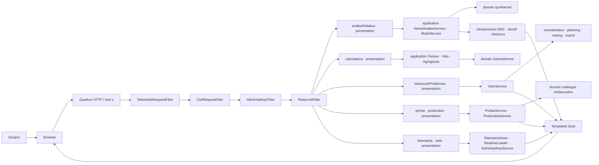
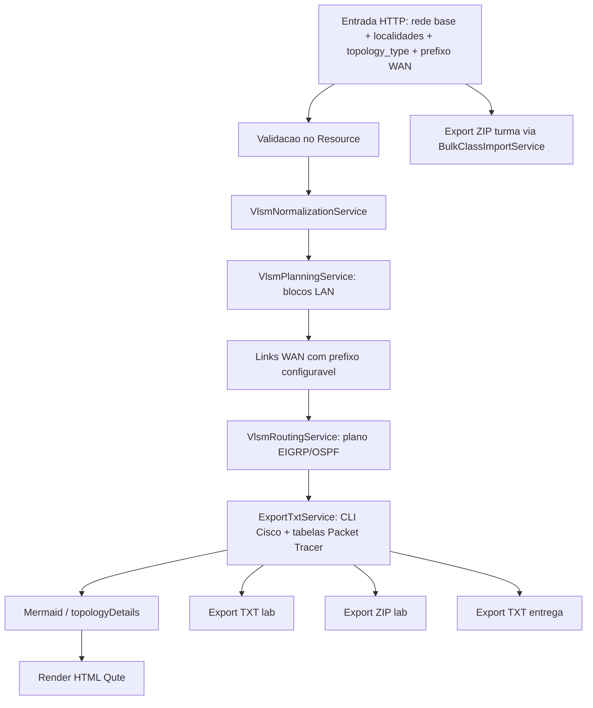
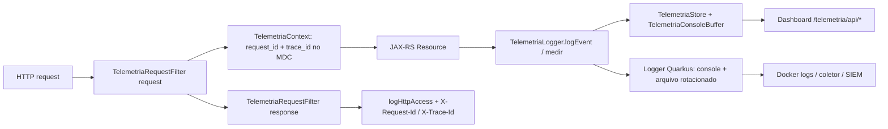
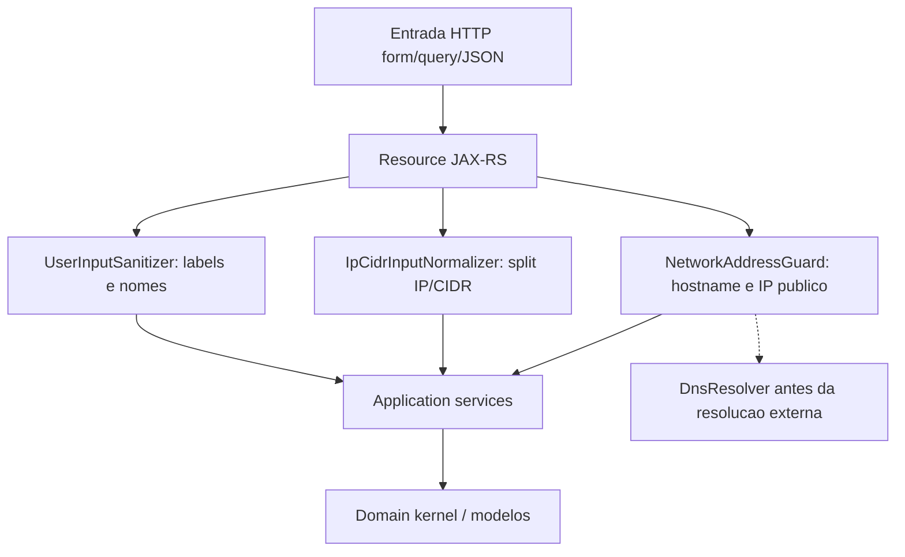
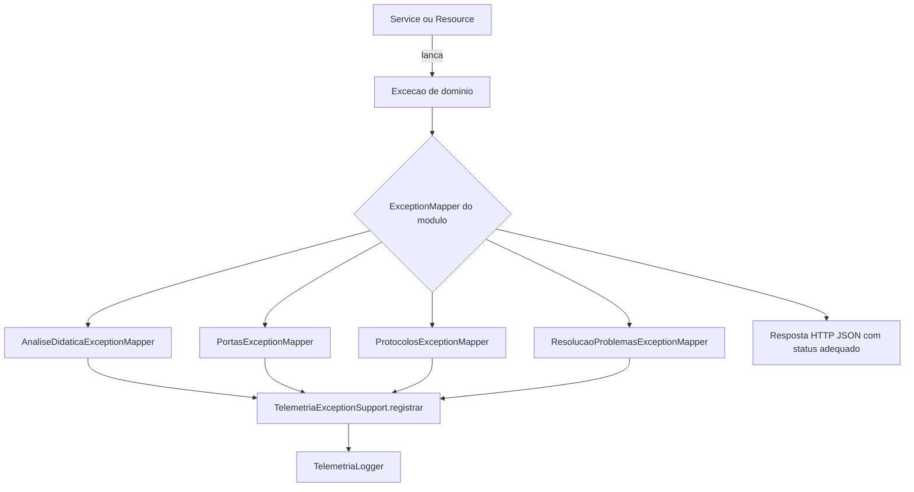
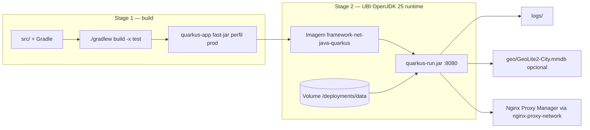
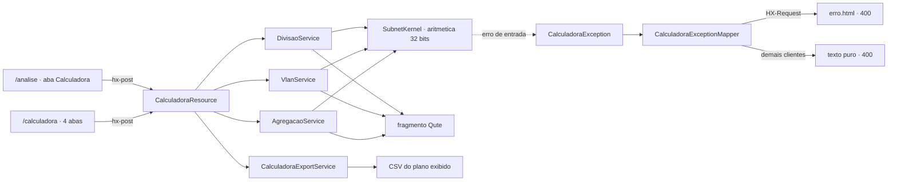
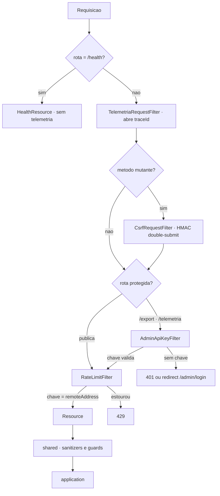
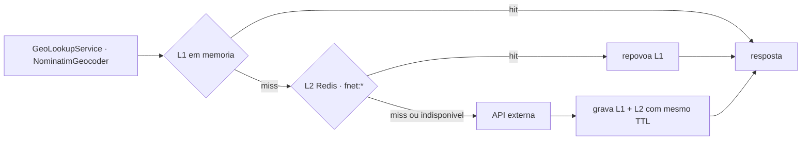

# 🛡️ Framework de Redes - Análise Didática Avançada

> **Versão Java/Quarkus** (`framework-net-java-quarkus`) — Java 25 + Quarkus 3.37.
> Migração do projeto original Python/Flask. Esta documentação é renderizada dentro da própria aplicação em `/documentacao`.

<p align="center">
  
</p>

Aplicação didática para análise de redes IPv4/IPv6, com foco em ensino, laboratório e revisão técnica. Originalmente escrita em **Python/Flask**, foi **migrada para Java 25 + Quarkus** e reorganizada como um **monólito modular** (*modular monolith*): um único artefato de implantação com domínios autocontidos, prontos para evoluir para microserviços. Reúne sete módulos:

- **Análise Didática** — CIDR, máscara, wildcard, auto-CIDR, domínio (DNS), IPv6, comparador e GeoIP.
- **Calculadora de Sub-redes e VLANs** — divisão de blocos (FLSM), plano de VLANs com script Cisco, sumarização de rotas e faixa de IPs para CIDR.
- **Portas** — catálogo interativo de portas TCP/UDP.
- **Protocolos** — catálogo de protocolos + troubleshooting de roteamento.
- **Resolução de Problemas (VLSM + WAN)** — planejamento VLSM dinâmico, topologia WAN, CLI Cisco e exportação para laboratório.
- **Telemetria** — dashboard de eventos e console ao vivo (server-side).
- **Documentação** — este README renderizado.

> Repositório: [https://github.com/carmipa/framework-net-java-quarkus](https://github.com/carmipa/framework-net-java-quarkus)

---

## 📚 Sumário

| # | Seção | O que responde |
|---|-------|----------------|
| 1 | Visão geral | para que serve e a quem atende |
| 2 | Módulos e rotas | tabela completa de endpoints, métodos e proteção |
| 3 | Funcionalidades | Análise Didática · **Calculadora de Sub-redes e VLANs** · Portas/Protocolos · Resolução VLSM+WAN |
| 4 | Arquitetura | 9 diagramas: fluxo geral, **Calculadora**, **camadas de proteção**, **cache em 2 níveis**, VLSM, telemetria, shared, exceções, deploy |
| 5 | Requisitos | Java, Gradle, Docker |
| 6 | Execução | local (`quarkusDev`) e VPS (`deploy.sh`) |
| 7 | Configuração | todas as `framework.*` e as `quarkus.*` relevantes |
| 8 | Segurança | CSRF, chave admin, rate limit, CSP/SRI, fail-closed de segredos |
| 9 | Telemetria | correlação por `traceId`, OTLP/JSON e **dataset público sanitizado** |
| 10 | Estrutura de pastas | onde mora cada coisa |
| 11 | Testes | incluindo os que guardam **regras** (arquitetura, cobertura de menu, CSP) |
| 12 | Roadmap | o que falta |

---

## 🎯 Visão Geral

O framework cobre um fluxo didático completo para aula, laboratório e revisão técnica:

- cálculo de rede/broadcast/hosts úteis;
- decomposição binária e tabela AND por octeto;
- conversão entre CIDR, máscara e wildcard;
- resolução de domínio (DNS) com cache e timeout;
- geolocalização de IP (GeoIP MaxMind, opcional);
- classificação e contexto de risco/GRC;
- geração automática de cenário de laboratório (VLSM, links WAN com prefixo configurável, CLI Cisco e exportação para laboratório ou entrega acadêmica em `.txt`/`.zip`).

---

## 🧭 Módulos e Rotas

| Módulo | Rota | Método | Descrição |
|--------|------|--------|-----------|
| Início | `/` | GET | Página inicial (landing) com atalhos para os módulos |
| Análise Didática | `/analise` | GET/POST | CIDR, máscara, wildcard, auto-CIDR, domínio, IPv6, comparador, calculadora (parâmetro `?tab=`) |
| Calculadora | `/calculadora` | GET | Divisão de blocos, plano de VLANs, sumarização e faixa→CIDR (parâmetro `?aba=`) |
| Calculadora (API) | `/calculadora/api/dividir` | POST | Fragmento HTML: sub-redes de um bloco + matriz de capacidade |
| Calculadora (API) | `/calculadora/api/vlan`, `/calculadora/api/vlan-id` | POST | Fragmento HTML: plano de VLANs com CLI Cisco / parecer sobre um VLAN ID |
| Calculadora (API) | `/calculadora/api/sumarizar`, `/calculadora/api/comparar`, `/calculadora/api/faixa` | POST | Fragmento HTML: rota resumo, relação entre blocos, faixa em CIDR |
| Calculadora (export) | `/calculadora/export/divisao.csv`, `/calculadora/export/vlan.csv` | GET | CSV do plano exibido |
| Localização | `/localizacao` | GET | Localização por IP e por CEP no mapa |
| Localização (API) | `/localizacao/api/ip`, `/localizacao/api/cep` | GET | JSON: geolocalização por IP / endereço por CEP (ViaCEP + OSM) |
| Tráfego | `/trafego` | GET | Sub-abas: painel ao vivo (simulação), decodificador (hex), encapsulamento e handshake TCP |
| Tráfego (API) | `/trafego/api/decodificar` | POST | JSON: camadas Ethernet/IP/TCP/UDP/ICMP decodificadas |
| Tráfego (API) | `/trafego/api/aovivo` | GET | JSON: snapshot do painel ao vivo (simulação demo) |
| Simuladores (API) | `/simuladores/api/encapsular` | POST | JSON: encapsulamento camada a camada (App→Enlace) |
| Simuladores (API) | `/simuladores/api/handshake` | GET | JSON: sequência do handshake TCP (`?dados=&encerramento=`) |
| GeoIP | `/informacoes` | GET | Página de geolocalização (`?ip=`) |
| GeoIP (API) | `/api/informacoes/geo` | GET | JSON de geolocalização (`?ip=`) |
| Referência de máscaras | `/mascara-referencia` | GET | Tabela JSON de máscaras/prefixos |
| Portas | `/portas` | GET | Catálogo interativo TCP/UDP |
| Protocolos | `/protocolos` | GET | Catálogo + troubleshooting de roteamento |
| Resolução VLSM | `/resolucao-problemas` | GET/POST | Cenários VLSM/WAN, demos e exportações |
| Telemetria | `/telemetria` | GET | Dashboard de eventos e console |
| Telemetria (API) | `/telemetria/api/*` | GET/POST | `resumo`, `dashboard`, `console`, `console/limpar`, `exportar`, `pasta` |
| Documentação | `/documentacao` | GET | Este README renderizado |
| Sobre | `/sobre` | GET | O projeto, o autor e as tecnologias |
| Sonda de saúde | `/health` | GET | JSON `{"status":"UP"}` para o healthcheck do container; **não** registrada na telemetria |
| Histórico (API) | `/history` | GET | Lista o histórico em JSON |
| Histórico catálogo | `/history/catalog` | POST | Registra consulta de portas/protocolos |
| Exportação análise | `/export/json`, `/export/pdf` | GET | 🔒 Protegido por chave administrativa |
| Login administrativo | `/admin/login`, `/admin/logout` | GET/POST | Autenticação para rotas sensíveis |

---

## 🚀 Funcionalidades

### Módulo 1 — Análise Didática (`/`)

Selecionável via `?tab=` (ou pelas abas da interface):

- `cidr` — IP + `/barra`;
- `mask` — decomposição por máscara decimal;
- `wildcard` — engenharia reversa com base ACL/OSPF;
- `autoip` — inferência didática de CIDR pelo IP;
- `dominio` — hostname/URL → DNS → análise;
- `ipv6` — visão básica com resumo técnico;
- `comparador` — comparação lado a lado entre dois prefixos;
- `calculadora` — divisão rápida de um bloco em sub-redes, servida pelo módulo Calculadora via htmx.

Recursos de apoio: geolocalização (`/informacoes`), tabela de referência de máscaras (`/mascara-referencia`), histórico paginado e exportações (`/export/json`, `/export/pdf`).

### Módulo 2 — Calculadora de Sub-redes e VLANs (`/calculadora`)

Ferramenta de bolso para plano de endereçamento — complementa o Módulo 4 (VLSM), que
resolve o **cenário** completo com WAN e roteamento. Aqui a resposta é imediata, em
sub-redes de tamanho fixo (**FLSM**). Quatro abas, selecionáveis via `?aba=`:

**`dividir` — divisão de blocos.** Responde a pergunta clássica: *um `/21`, quantas
redes cabem?* Três critérios de entrada:

| Critério | Entrada | Exemplo |
|----------|---------|---------|
| Por prefixo alvo | prefixo desejado | `192.168.0.0/21` → `/24` = **8 sub-redes** de 254 hosts |
| Por nº de sub-redes | quantas você precisa | pedir 6 entrega 8 (potências de 2), com a sobra declarada |
| Por hosts | hosts por sub-rede | 500 hosts → `/23` (reserva rede e broadcast: 502 endereços) |

Acompanha a **matriz de capacidade**, que responde todos os prefixos de uma vez
(`/22`→2, `/24`→8, `/26`→32, `/30`→512), e exportação em CSV.

**`vlan` — plano de VLANs.** Gera o mapa VLAN ↔ sub-rede com gateway (SVI), faixa
DHCP e wildcard para ACL, mais o script Cisco pronto (`vlan`/`name`, portas de acesso,
tronco 802.1Q com `switchport trunk allowed vlan`, SVI **e** router-on-a-stick,
`ip dhcp pool`). Duas estratégias de mapeamento: **sequencial** (blocos consecutivos)
ou **VLAN ID no 3º octeto** (VLAN 10 → `192.168.10.0/24`, a convenção de prova; exige
bloco base `/16` e `/24` por VLAN). Inclui **validador de VLAN ID** com as faixas do
padrão: 0 e 4095 reservados pelo 802.1Q, 1 default, 2–1001 normal range, 1002–1005
reservadas pela Cisco (FDDI/Token Ring) e 1006–4094 extended range.

**`agregar` — sumarização e comparação.** Calcula a **rota resumo** (menor prefixo que
cobre todas as redes informadas) com os comandos de `area range` (OSPF),
`ip summary-address` (EIGRP), rota estática e ACL — declarando quanto espaço extra a
agregação arrasta. E compara dois blocos: iguais, contido ou disjuntos, com os
endereços em comum.

**`faixa` — faixa de IPs para CIDR.** Converte "de `10.0.0.5` até `10.0.3.200`" na
menor lista de blocos CIDR que cobre **exatamente** a faixa, com a ACL equivalente.

> **Tetos de renderização.** Um `/8` dividido em `/30` são 4.194.304 sub-redes. A tela
> lista no máximo `framework.calculadora.max-linhas` (padrão 512), mas o total
> matemático real continua sendo exibido, com aviso explícito de truncamento — listagem
> truncada nunca é apresentada como plano completo.

### Módulo 3 — Portas (`/portas`) e Protocolos (`/protocolos`)

- catálogo didático com filtros;
- resumo IGP/EGP e bloco **Troubleshooting rápido (roteamento)** na página de protocolos;
- registro opcional das consultas no histórico via `/history/catalog`.

### Módulo 4 — Resolução de Problemas (VLSM + WAN) (`/resolucao-problemas`)

- entrada dinâmica com N localidades (nome + **quantidade de hosts** — o sistema calcula o CIDR pela fórmula `2^H ≥ N+2` → prefixo `32−H`);
- **obrigatório:** IP/rede base e localidades; **opcional:** CIDR da base (inferência classful se vazio), AS EIGRP (padrão `71`), processo OSPF (padrão `1`);
- **prefixo WAN** configurável (padrão `/30` para enlaces ponto a ponto, faixa `0–30`);
- topologias WAN: `star`, `extended_star`, `mesh`, `ring` e `ring_redundant` (aceita também os aliases `estrela` e `estrela_estendida`);
- roteamento **EIGRP/OSPF** por distribuição (`eigrp_only`, `ospf_only`, metade/metade, `auto`);
- acesso remoto VTY: **Telnet** (padrão, com `transport input telnet`), SSH ou ambos;
- diagrama de topologia interativo no navegador;
- demos na URL: `?demo=gs` (Global Solution Mazola), `?demo=fiap`, `?demo=8`, `?demo=1`;
- exportações **após calcular** (recalculam o cenário e baixam o arquivo).

#### Exportações

| Ação (`action_type`) | Arquivo | Conteúdo |
|----------------------|---------|----------|
| `export` | `config_packet_tracer_consolidado.txt` | scripts IOS consolidados |
| `export_zip` | `laboratorio_packet_tracer.zip` | guia de montagem, configs por roteador, README |
| `export_entrega` | `documentacao_cenario_rede.txt` | relatório completo para disciplina |
| `export_class_zip` | `pacote_turma_packet_tracer.zip` | pacote por aluno (`por_aluno/<aluno>/`) |

#### Importar turma (Excel)

Cole na página de Resolução (TAB entre colunas):

```
Nome | Rede base | Hosts1 | Hosts2
```

---

## 🏗️ Arquitetura

Estilo arquitetural: **monólito modular** (*modular monolith*) em **Java 25 + Quarkus**, migrado do projeto original em Python/Flask. A aplicação é implantada como **um único artefato** (Quarkus fast-jar), mas o código é organizado por **domínios autocontidos** (*bounded contexts*) — cada módulo funciona como um "microserviço interno", com fronteiras claras e baixo acoplamento, pronto para ser extraído para um serviço independente caso o projeto evolua nesse sentido.

- **Runtime único**: endpoints **JAX-RS** (`quarkus-rest`) e views em **Qute** (`quarkus-rest-qute`) sobre `quarkus-vertx-http`.
- **Módulos de domínio**: `analiseDidatica`, `calculadora`, `portas`, `protocolos`, `resolucaoProblemas`, `localizacao`, `analiseTrafego`, `ferramentasDiagnostico`, `segurancaRede`, `simuladores` (encapsulamento e handshake TCP — computação pura, VPS-safe).
- **Módulos transversais**: `security` (CSRF, rate limit, chave admin), `telemetria` (observabilidade), `web` (documentação, login, ícone) e `shared` (sanitização e utilitários de entrada).

### Camadas por módulo (organização DDD-lite / hexagonal)

Cada domínio de negócio segue a mesma separação de responsabilidades:

| Camada | Responsabilidade | Exemplos |
|--------|------------------|----------|
| `presentation` | Endpoints JAX-RS (`@Path`) e binding com templates Qute | `AnaliseDidaticaResource`, `ResolucaoProblemasResource` |
| `application` | Casos de uso / serviços de orquestração | `HomeAnaliseService`, `VlsmService`, `export/`, `planning/`, `routing/` |
| `domain` | Regras de negócio puras (kernel + modelos) | `Ipv4Kernel`, `domain/model` |
| `infrastructure` | Integrações externas e persistência | `dns/`, `geo/` (MaxMind), `historico/` |
| `support` / `config` / `exception` | Apoio à UI, configuração e mapeamento de erros | `AnaliseDidaticaUiSupport`, `DnsConfig`, `*ExceptionMapper` |


```mermaid
flowchart LR
    U[Usuário] --> W[Browser]
    W --> HTTP[Quarkus HTTP / Vert.x]
    HTTP --> F1[TelemetriaRequestFilter]
    F1 --> F2[CsrfRequestFilter]
    F2 --> F3[AdminApiKeyFilter]
    F3 --> F4[RateLimitFilter]
    F4 --> R1[analiseDidatica · presentation]
    F4 --> R5[calculadora · presentation]
    F4 --> R2[resolucaoProblemas · presentation]
    F4 --> R3[portas · protocolos · presentation]
    F4 --> R4[telemetria · web · presentation]
    R1 --> A1[application HomeAnaliseService · ModoService]
    A1 --> D1[domain Ipv4Kernel]
    A1 --> I1[infrastructure DNS · GeoIP · Historico]
    R5 --> A5[application Divisao · Vlan · Agregacao]
    A5 --> D5[domain SubnetKernel]
    R2 --> A2[VlsmService]
    A2 --> A2a[normalization · planning · routing · export]
    R3 --> A3[PortasService · ProtocolosService]
    A3 --> D3[domain catálogos embarcados]
    R4 --> A4[TelemetriaStore · ReadmeLoader · AdminApiKeyService]
    I1 --> T[Templates Qute]
    A2 --> T
    A3 --> T
    A4 --> T
    T --> W
```

Ordem real dos filtros JAX-RS (prioridade): `TelemetriaRequestFilter` → `CsrfRequestFilter` → `AdminApiKeyFilter` → `RateLimitFilter` → Resource.

Módulos em `presentation`:

| Pacote | Resources principais |
|--------|----------------------|
| `analiseDidatica` | `/`, `/informacoes`, `/api/informacoes/geo`, `/mascara-referencia`, `/history`, `/export/*` |
| `resolucaoProblemas` | `/resolucao-problemas` |
| `portas` / `protocolos` | `/portas`, `/protocolos` |
| `telemetria` | `/telemetria`, `/telemetria/api/*` |
| `web` | `/documentacao`, `/admin/*`, `/icone.png` |

### Fluxo do módulo VLSM/WAN


```mermaid
flowchart TD
    I[Entrada HTTP: rede base + localidades + topology_type + prefixo WAN] --> V[Validacao no Resource]
    V --> N[VlsmNormalizationService]
    N --> L[VlsmPlanningService: blocos LAN]
    L --> W[Links WAN com prefixo configuravel]
    W --> R[VlsmRoutingService: plano EIGRP/OSPF]
    R --> C[ExportTxtService: CLI Cisco + tabelas Packet Tracer]
    C --> M[Mermaid / topologyDetails]
    M --> O[Render HTML Qute]
    C --> E1[Export TXT lab]
    C --> E2[Export ZIP lab]
    C --> E3[Export TXT entrega]
    I --> E4[Export ZIP turma via BulkClassImportService]
```

### Fluxo de telemetria (server-side)


```mermaid
flowchart LR
    Req[HTTP request] --> Flt[TelemetriaRequestFilter request]
    Flt --> Ctx[TelemetriaContext: request_id + trace_id no MDC]
    Ctx --> Res[JAX-RS Resource]
    Res --> Ev[TelemetriaLogger.logEvent / medir]
    Ev --> Store[TelemetriaStore + TelemetriaConsoleBuffer]
    Ev --> Log[Logger Quarkus: console + arquivo rotacionado]
    Flt --> Resp[TelemetriaRequestFilter response]
    Resp --> Acc[logHttpAccess + X-Request-Id / X-Trace-Id]
    Store --> Dash[Dashboard /telemetria/api/*]
    Log --> Obs[Docker logs / coletor / SIEM]
```

### Utilitários transversais (`shared`)

Entrada do usuário passa por utilitários compartilhados **antes** dos services de domínio, reduzindo risco de injeção, IPs privados/reservados e formatos inválidos.


```mermaid
flowchart TD
    IN[Entrada HTTP form/query/JSON] --> R[Resource JAX-RS]
    R --> S1[UserInputSanitizer: labels e nomes]
    R --> S2[IpCidrInputNormalizer: split IP/CIDR]
    R --> S3[NetworkAddressGuard: hostname e IP publico]
    S1 --> APP[Application services]
    S2 --> APP
    S3 --> APP
    APP --> DOM[Domain kernel / modelos]
    S3 -.-> DNS[DnsResolver antes da resolucao externa]
```

| Classe | Uso principal |
|--------|----------------|
| `UserInputSanitizer` | Nomes de localidade, roster da turma, labels Mermaid |
| `IpCidrInputNormalizer` | Separação e normalização de IP + CIDR na análise e resolução |
| `NetworkAddressGuard` | Bloqueio de hostnames reservados e endereços não públicos no DNS |

### Tratamento de exceções (`ExceptionMapper`)

Cada módulo de domínio possui um `@Provider` JAX-RS que converte exceções tipadas em respostas HTTP seguras e registra o evento na telemetria.


```mermaid
flowchart TD
    SVC[Service ou Resource] -->|lanca| EX[Excecao de dominio]
    EX --> M{ExceptionMapper do modulo}
    M --> A[AnaliseDidaticaExceptionMapper]
    M --> P[PortasExceptionMapper]
    M --> PR[ProtocolosExceptionMapper]
    M --> R[ResolucaoProblemasExceptionMapper]
    A --> T[TelemetriaExceptionSupport.registrar]
    P --> T
    PR --> T
    R --> T
    T --> TL[TelemetriaLogger]
    M --> HTTP[Resposta HTTP JSON com status adequado]
```

| Mapper | Exceção | Status típico |
|--------|---------|---------------|
| `AnaliseDidaticaExceptionMapper` | `EntradaInvalidaException` | `400` |
| `AnaliseDidaticaExceptionMapper` | `DnsResolucaoException` | `500` |
| `PortasExceptionMapper` | `PortasException` | conforme tipo |
| `ProtocolosExceptionMapper` | `ProtocolosException` | conforme tipo |
| `ResolucaoProblemasExceptionMapper` | `EntradaInvalidaException` / `ResolucaoProblemasException` | `400` / `500` |

> Páginas HTML (Qute) tratam erros de validação inline no Resource (`erro` + `invalidFields` no template), sem passar pelo mapper — os mappers cobrem principalmente respostas JSON e falhas de domínio não capturadas.

### Deploy Docker (build multi-stage → runtime)


```mermaid
flowchart LR
    subgraph build [Stage 1 — build]
        SRC[src/ + Gradle] --> GRAD[./gradlew build -x test]
        GRAD --> JAR[quarkus-app fast-jar perfil prod]
    end
    subgraph runtime [Stage 2 — UBI OpenJDK 25 runtime]
        JAR --> IMG[Imagem framework-net-java-quarkus]
        IMG --> RUN[quarkus-run.jar :8080]
        VOL[(Volume /deployments/data)] --> RUN
    end
    RUN --> LOGS[logs/]
    RUN --> GEO[geo/GeoLite2-City.mmdb opcional]
    RUN --> NPM[Nginx Proxy Manager via nginx-proxy-network]
```

| Etapa | Detalhe |
|-------|---------|
| **Build** | `eclipse-temurin:25-jdk-noble` → `./gradlew build -x test` com `-Dquarkus.package.jar.type=fast-jar -Dquarkus.profile=prod` |
| **Runtime** | `registry.access.redhat.com/ubi9/openjdk-25-runtime` — usuário `185`, healthcheck em `/health` |
| **Volume** | `framework-net-data:/deployments/data` — logs, GeoIP e dados da aplicação |
| **Env obrigatórias (prod)** | `ADMIN_API_KEY`, `CSRF_SECRET`, `QUARKUS_PROFILE=prod` |
| **Rede (VPS)** | `nginx-proxy-network` (externa) + bind `127.0.0.1:${HTTP_PORT}:8080` |
| **Dev Docker** | `docker-compose.dev.yml` — dados em `./docker-data`, porta padrão `8081` |

---

### Calculadora de Sub-redes e VLANs — fluxo

Dois pontos de entrada, **um** serviço: a aba em `/analise` e a página `/calculadora`
chamam o mesmo endpoint e recebem o mesmo fragmento Qute renderizado no servidor.


```mermaid
flowchart LR
    ABA["/analise · aba Calculadora"] -->|hx-post| EP
    PAG["/calculadora · 4 abas"] -->|hx-post| EP
    EP[CalculadoraResource] --> DIV[DivisaoService]
    EP --> VLA[VlanService]
    EP --> AGR[AgregacaoService]
    EP --> EXP[CalculadoraExportService]
    DIV --> K[SubnetKernel · aritmetica 32 bits]
    VLA --> K
    AGR --> K
    DIV --> FR[fragmento Qute]
    VLA --> FR
    AGR --> FR
    EXP --> CSV[CSV do plano exibido]
    K -.erro de entrada.-> EXC[CalculadoraException]
    EXC --> MAP[CalculadoraExceptionMapper]
    MAP -->|HX-Request| ERRHTML[erro.html · 400]
    MAP -->|demais clientes| ERRTXT[texto puro · 400]
```

Tetos de renderização (`framework.calculadora.*`) ficam entre o serviço e o
fragmento: o total matemático é sempre calculado, mas a listagem é truncada e o
truncamento é declarado na tela.

### Camadas de proteção da requisição

Cada filtro assume que o anterior falhou. A ordem importa: a telemetria abre a
correlação antes de tudo, e o rate limit fecha a fila antes de o recurso ser tocado.


```mermaid
flowchart TB
    REQ[Requisicao] --> H{rota = /health?}
    H -->|sim| SONDA[HealthResource · sem telemetria]
    H -->|nao| T[TelemetriaRequestFilter · abre traceId]
    T --> C{metodo mutante?}
    C -->|sim| CSRF[CsrfRequestFilter · HMAC double-submit]
    C -->|nao| ADM
    CSRF --> ADM{rota protegida?}
    ADM -->|/export · /telemetria| KEY[AdminApiKeyFilter]
    ADM -->|publica| RL
    KEY -->|sem chave| L401[401 ou redirect /admin/login]
    KEY -->|chave valida| RL[RateLimitFilter]
    RL -->|chave = remoteAddress| REC[Resource]
    RL -->|estourou| L429[429]
    REC --> SAN[shared · sanitizers e guards]
    SAN --> APP[application]
```

No boot, `SegredosObrigatoriosVerificador` recusa iniciar em produção sem
`ADMIN_API_KEY`/`CSRF_SECRET` — antes, a variável ausente desligava a proteção em
silêncio.

### Cache de APIs externas em dois níveis


```mermaid
flowchart LR
    S[GeoLookupService · NominatimGeocoder] --> L1{L1 em memoria}
    L1 -->|hit| OK[resposta]
    L1 -->|miss| L2{L2 Redis · fnet:*}
    L2 -->|hit| REP[repovoa L1] --> OK
    L2 -->|miss ou indisponivel| ORI[API externa]
    ORI --> GRAVA[grava L1 + L2 com mesmo TTL] --> OK
```

O L2 existe porque o L1 morre a cada deploy e as origens têm limite —
`ip-api.com` corta em 45 req/min. Redis indisponível faz o L2 se comportar como
miss permanente: volta ao comportamento de antes, sem quebrar nada.

---

## ✅ Requisitos

- **JDK 25**
- Gradle (wrapper incluído — `gradlew` / `gradlew.bat`)
- Docker (opcional, para deploy)

Dependências principais (`build.gradle`): `quarkus-rest`, `quarkus-rest-jackson`, `quarkus-rest-qute`, `quarkus-qute`, `quarkus-cache`, `quarkus-vertx-http`, `com.github.seancfoley:ipaddress:5.5.1`, `com.maxmind.geoip2:geoip2:4.2.0`.

---

## ▶️ Execução

### Java / Quarkus local

Windows PowerShell:

```powershell
.\gradlew.bat quarkusDev
```

Linux/macOS:

```bash
./gradlew quarkusDev
```

Aplicação em `http://localhost:8080`. Em modo dev, o navegador abre automaticamente quando `%dev.framework.dev.open-browser=true`.

### Docker (VPS)

```bash
docker compose -f docker-compose.yml up -d --build
```

O perfil `prod` (`QUARKUS_PROFILE=prod`) habilita proxy reverso e grava dados persistentes em `/deployments/data`. É **obrigatório** definir `ADMIN_API_KEY` e `CSRF_SECRET` (ver `.env.example` / `docker-compose.yml`).

Parar:

```bash
docker compose -f docker-compose.yml down
```

---

## ⚙️ Variáveis de Configuração

As chaves são definidas em `application.properties` (dev) e `application-prod.properties` (deploy), podendo ser sobrescritas por variáveis de ambiente.

### Aplicação

| Propriedade | Padrão | Descrição |
|-------------|--------|-----------|
| `quarkus.http.port` | `8080` | Porta HTTP |
| `quarkus.http.host` | `0.0.0.0` | Host de bind |
| `framework.app.max-history` | `60` | Tamanho máximo do histórico |
| `framework.calculadora.max-linhas` | `512` | Sub-redes **renderizadas** por divisão. O total real continua sendo calculado e exibido — o teto evita travar o navegador (um `/8` em `/30` são 4.194.304) |
| `framework.calculadora.max-vlans` | `256` | VLANs geradas por plano |
| `framework.calculadora.max-redes-agregacao` | `64` | Redes aceitas por sumarização |
| `framework.app.comparador-cidr-padrao-a` | `20` | CIDR padrão do comparador (A) |
| `framework.app.comparador-cidr-padrao-b` | `24` | CIDR padrão do comparador (B) |
| `framework.dns.cache-ttl-seconds` | `180` | TTL do cache DNS |
| `framework.dns.resolve-timeout-seconds` | `3` | Timeout de resolução DNS |
| `framework.geo.cache-ttl-seconds` | `300` | TTL do cache GeoIP |
| `framework.geo.database-path` | `geo/GeoLite2-City.mmdb` | Base MaxMind (opcional) |
| `framework.dev.open-browser` | `true` (dev) | Abre navegador no `quarkusDev` |

### Telemetria

| Propriedade | Padrão | Descrição |
|-------------|--------|-----------|
| `framework.logs.base-dir` | `logs` | Pasta de logs/exportações |
| `framework.telemetry.enabled` | `true` | Habilita coleta |
| `framework.telemetry.dashboard-enabled` | `true` | Habilita a página `/telemetria` |
| `framework.telemetry.max-events` | `5000` | Eventos em buffer |
| `framework.telemetry.jsonl-max-bytes` | `10485760` | Limite do JSONL ativo antes de manter uma única geração anterior |

### Segurança

| Propriedade | Padrão (dev) | Descrição |
|-------------|--------------|-----------|
| `framework.security.csrf-enabled` | `true` | Proteção CSRF |
| `framework.security.csrf-secret` | *(dev)* | Segredo do token CSRF — **trocar em prod** (`CSRF_SECRET`) |
| `framework.security.sensitive-apis-enabled` | `true` | Habilita APIs sensíveis |
| `framework.security.rate-limit-enabled` | `true` | Habilita rate limiting |
| `framework.security.rate-limit-per-minute` | `120` | Limite geral por minuto |
| `framework.security.rate-limit-heavy-per-minute` | `30` | Limite de rotas pesadas |
| `framework.security.admin-api-key` | *(dev)* | Chave admin — em prod via `ADMIN_API_KEY` |
| `framework.security.admin-api-key-required` | `true` | Exige chave nas rotas protegidas |

### Variáveis de ambiente (deploy Docker)

- `HTTP_PORT` (padrão `8080`) — porta publicada no host;
- `ADMIN_API_KEY` — **obrigatória** em prod; gere uma vez e mantenha no `.env` da VPS;
- `CSRF_SECRET` — **obrigatória** em prod; gere uma vez e mantenha no `.env` da VPS;
- `GEO_DB_HOST_PATH` — caminho do `GeoLite2-City.mmdb` no host (opcional);
- `QUARKUS_PROFILE=prod`.

Comandos seguros de deploy na VPS:

```bash
cd /opt/framework-net-java-quarkus
git pull origin main
test -f .env || cp .env.example .env
docker compose up -d --build
docker compose ps
docker compose logs --tail=20 -f
```

Deploy automatizado:

```bash
cd /opt/framework-net-java-quarkus
chmod +x scripts/deploy.sh
scripts/deploy.sh
```

---

## 🔐 Segurança

- **Chave administrativa** — rotas sob o prefixo `/export` são protegidas. O acesso é liberado por:
  - header `X-Admin-Api-Key: <chave>`, **ou**
  - cookie `ADMIN_API_KEY` obtido via login em `/admin/login`.
  - A exigência só é ativada quando `admin-api-key-required=true` **e** a chave está configurada; a comparação usa tempo constante.
- **CSRF** — filtros de request/response emitem e validam token para operações sensíveis.
- **Rate limiting** — limites por minuto configuráveis (geral e rotas pesadas).
- **Headers HTTP de segurança** — `X-Content-Type-Options: nosniff`, `X-Frame-Options: SAMEORIGIN`, `Referrer-Policy: strict-origin-when-cross-origin`, `Permissions-Policy` restritiva.
- **Sanitização de entrada** — `UserInputSanitizer`, `IpCidrInputNormalizer` e `NetworkAddressGuard` no pacote `shared`.

---

## 📋 Telemetria e Observabilidade (Server-Side)

A telemetria é orientada a servidor e possui dashboard próprio em `/telemetria`.

Implementado:

- `request_id` e `trace_id` por requisição (via `TelemetriaRequestFilter` + MDC);
- eventos estruturados (`TelemetriaLogger.logEvent` / `logException`);
- buffer em memória + arquivo compartilhado (`TelemetriaStore`);
- console ao vivo e exportação JSON (`/telemetria/api/exportar`);
- logs em console e arquivo com rotação (`quarkus.log.file.*`);
- a sonda `/health` do container **não** é registrada — antes o healthcheck consultava
  `/` a cada 30 s (~2.880 acessos/dia) e era indistinguível de visitas reais.

### Correlação dos eventos de negócio

Serviços de aplicação chamam `TelemetriaLogger.medir()` sem ter o
`ContainerRequestContext` do JAX-RS em mãos. A correlação é então **resgatada do MDC**
da própria thread da requisição (`TelemetriaContext.contextoDoMdc()`), de modo que todo
evento nascido dentro de um request carrega `traceId` e `requestId`.

Isso importa porque um único incidente rende mais de um evento — a operação de negócio
que falhou, a exceção mapeada e o acesso HTTP. **Agrupe por `traceId`** para contar
incidentes em vez de linhas. Eventos nascidos fora de requisição (`app_start`, tarefas
de fundo) seguem sem correlação, e isso é o valor honesto: correlação fabricada seria
pior que correlação ausente.

### Formato de compartilhamento: OpenTelemetry OTLP/JSON

Os artefatos compartilháveis seguem o **[OpenTelemetry Logs Data Model](https://opentelemetry.io/docs/specs/otel/logs/data-model/)** serializado em **OTLP/JSON** — o padrão da indústria para interoperar telemetria com Grafana, Loki, Jaeger, Datadog, SIEMs, etc.

| Artefato | Formato | Descrição |
|----------|---------|-----------|
| `logs/telemetria_compartilhada.json` | OTLP `LogsData` | Documento canônico (`resourceLogs → scopeLogs → logRecords`) |
| `logs/framework-net-eventos.jsonl` | NDJSON de `LogRecord` OTLP | Stream append (um `LogRecord` por linha) |
| `GET /telemetria/api/exportar` | OTLP `LogsData` | Download do documento canônico |

Mapeamento (`TelemetriaOtlpMapper`): `timeUnixNano`/`intValue` como *string* (int64 conforme OTLP/JSON), `severityNumber`/`severityText` (INFO=9, WARN=13, ERROR=17), `traceId`/`spanId` em hexadecimal, e atributos com convenções semânticas (`service.name`, `http.request.method`, `http.route`, `http.response.status_code`, `event.name`) + atributos próprios em `framework.*`.

> As APIs internas do dashboard (`/telemetria/api/resumo` e `/telemetria/api/dashboard`) permanecem no schema próprio de UI — o OTLP é usado nos artefatos de **exportação/compartilhamento**.

Coleta recomendada em produção: `docker logs` / `compose logs` e agregador central (ELK, Loki, Datadog, Splunk, SIEM) — o OTLP/JSON pode ser reenviado a um OpenTelemetry Collector.

### Dataset público (sanitização)

A telemetria é artefato temporário destinado a virar **dataset público**. Entre o
arquivo cru e o repositório existe uma etapa obrigatória de sanitização, executada
na VPS por dois scripts sem dependências externas:

```bash
./scripts/exportar-dataset.sh            # extrai do container, sanitiza, gera dataset/AAAA-MM-DD/
```

| Script | Papel |
|--------|-------|
| `scripts/exportar-dataset.sh` | Extrai o NDJSON do container, garante o sal no `.env` e chama o sanitizador |
| `scripts/sanitizar_telemetria.py` | Sanitiza, audita e gera `eventos.jsonl` + `README.md` + `schema.json` + `estatisticas.json` (Python 3, só stdlib) |

**A distinção que sustenta as regras: identidade × conteúdo didático.** O mesmo campo
`framework.field.ip` guarda tanto o endereço que o servidor observou (identidade)
quanto o que o usuário digitou no formulário de GeoIP (exercício). O nome do campo não
distingue — **o valor sim**: IPv4 roteável ou IPv6 é identidade e vira hash; faixa
privada, loopback, documentação e resolvedores públicos conhecidos (`8.8.8.8`,
`1.1.1.1`…) permanecem legíveis. Pseudonimizar conteúdo didático esvaziaria o dataset
sem proteger ninguém: `baseNetwork=192.19.0.0/16` digitado num exercício de VLSM **é**
o dado que dá valor ao arquivo.

| Dado | Tratamento |
|------|------------|
| IP identificador | `SHA-256(sal + valor)` truncado em 12 hex — estável (conta visitantes únicos), irreversível sem o sal |
| `lat` / `lon` | **Removidos** — 6 casas decimais são ~10 cm; nem hash nem arredondamento tornam publicável |
| `body` (texto livre) | **Reconstruído** a partir dos atributos já sanitizados, nunca filtrado por regex — o body repetia os valores (`evento=geo_lookup status=ok ip=…`) |
| `traceId` / `spanId` / `request_id` | Preservados — aleatórios por requisição, não identificam, e são o que torna o dataset analisável |
| Estáticos, `/q/*`, `/web/*`, `/telemetria/api*`, `/health` | Descartados como ruído de infraestrutura |

O sal vive no `.env` da VPS, é gerado uma vez e **nunca** entra no dataset; trocá-lo
quebra a continuidade dos pseudônimos entre datasets já publicados.

Ao final, uma **auditoria bloqueante** varre o arquivo gerado provando que nenhum valor
de identidade sobreviveu, em qualquer campo — se achar, apaga a saída e falha. IPv4
roteáveis que restaram (conteúdo de exercício) são listados para conferência humana.
O script **não** faz `git push`: publicação é irreversível assim que indexada, então é
decisão humana e não de cron.

---

## 🗂️ Estrutura de Pastas

```text
framework-net-java-quarkus/
├── build.gradle · settings.gradle · gradle.properties · gradlew(.bat)
├── Dockerfile · docker-compose.yml · docker-compose.dev.yml · .env.example
├── logs/
├── src/main/java/org/framework/net/
│   ├── analiseDidatica/     # application, config, domain/kernel, infrastructure (dns/geo/historico), presentation, support
│   ├── calculadora/         # application, config, domain, exception, presentation
│   ├── portas/              # application, domain, exception, presentation
│   ├── protocolos/          # application, domain, exception, presentation
│   ├── resolucaoProblemas/  # application (export/importing/normalization/planning/routing), domain (kernel/model), presentation
│   ├── security/            # Admin API key, CSRF, rate limit, sensitive APIs
│   ├── shared/              # sanitizers, guards e normalizadores de entrada
│   ├── telemetria/          # store, dashboard, filter, presentation
│   └── web/                 # documentacao, admin login, ícone, filtros, support
├── src/main/resources/
│   ├── application.properties · application-prod.properties
│   ├── README.md            # esta documentação (renderizada em /documentacao)
│   ├── templates/           # Qute: home, analiseDidatica, portas, protocolos, resolucaoProblemas, telemetria, admin, documentacao, shared
│   └── META-INF/resources/  # estáticos: CSS por módulo (home/, portas/, protocolos/, telemetria/, resolucaoProblemas/, documentacao/) + web/ (design system compartilhado) + JS + ícone
└── src/test/java/org/framework/net/   # JUnit 5 + RestAssured
```

---

## 🧪 Testes

Suíte em **JUnit 5** + **RestAssured** (`quarkus-junit`, `rest-assured`), em `src/test/java`.

```powershell
.\gradlew.bat test
```

Cobertura por área:

| Área | Exemplos de testes |
|------|--------------------|
| Análise Didática | `Ipv4KernelTest`, `AnaliseDidaticaHttpTest`, `AnaliseExportHttpTest`, `HistoricoApiHttpTest`, `GeoLookupServiceTest`, `PdfSimplesServiceTest` |
| Calculadora | `DivisaoServiceTest`, `VlanServiceTest`, `AgregacaoServiceTest`, `CalculadoraHttpTest` |
| Saúde | `HealthResourceTest` |
| Portas / Protocolos | `PortasServiceTest`, `ProtocolosServiceTest` |
| Resolução VLSM/WAN | `VlsmServiceTest`, `VlsmPlanningServiceTest`, `ResolucaoProblemasHttpTest`, `BulkClassImportServiceTest` |
| Segurança | `AdminApiKeyServiceTest`, `AdminApiKeyHttpTest`, `CsrfTokenServiceTest` |
| Telemetria | `TelemetriaLoggerTest`, `TelemetriaHttpTest`, `TelemetriaConsoleBufferTest`, `TelemetryDisabledHttpTest`, `TelemetriaStoreRotationTest`, `ModuloDePathTest`, `CorrelacaoEventosTest` |
| Menu e rotas | `MenuRotasHttpTest` |
| Arquitetura | `ArquiteturaCamadasTest` |
| Shared / Web | `UserInputSanitizerTest`, `IpCidrInputNormalizerTest`, `NetworkAddressGuardTest`, `WebIntegrationTest`, `DevBrowserLauncherTest` |

### Testes que guardam regras, não só comportamento

Três suítes existem para impedir classes inteiras de regressão, e não para verificar
um caso de uso:

- **`ArquiteturaCamadasTest`** — lê os imports dos fontes e reprova o build se
  `domain` passar a conhecer HTTP/Qute/camadas externas, se `application` importar
  `presentation`, se dois módulos de negócio se acoplarem sem registro explícito, ou
  se um `@Path` aparecer fora de `presentation`.
- **`MenuRotasHttpTest`** — abre as 13 rotas do menu, confere que cada uma se marca
  como ativa e navega para as demais. Conta os itens no HTML renderizado: **item novo
  no menu sem teste correspondente quebra o build**.
- **`ModuloDePathTest`** — trava a tabela que atribui cada rota a um módulo no
  dashboard. Existe porque o `default` do switch apontava para "Análise Didática", e
  com isso `/calculadora`, `/sobre`, `/admin` e `/simuladores` eram silenciosamente
  contabilizados no módulo errado — bug que não gera exceção, só número errado.

### Ao criar um módulo novo, atualize também

1. `shared/main_menu.html` **e** `MenuRotasHttpTest` (a contagem de itens é verificada);
2. `RateLimitFilter.HEAVY_PATHS` — e o `startsWith` do subcaminho, se as APIs forem pesadas;
3. `TelemetriaDashboardService.moduloDePath` — senão o tráfego é creditado a outro módulo;
4. `templates/home/index.html` — o bloco do módulo na landing;
5. este README.

---

## 🛣️ Roadmap

- [x] Migração de Python/Flask para Java 25 + Quarkus 3.37
- [x] VLSM dinâmico para N localidades
- [x] Topologias WAN estrela / estrela estendida / malha / anel / anel redundante
- [x] EIGRP + OSPF (distribuição por site, AS/processo opcionais)
- [x] Telnet explícito nos scripts (`transport input telnet`)
- [x] Demos (`?demo=gs|fiap|8|1`) e exportações lab/entrega/turma
- [x] Prefixo WAN configurável e CIDR da base opcional com inferência
- [x] Catálogos de portas e protocolos
- [x] Módulo de telemetria com dashboard e console ao vivo
- [x] Segurança: chave admin, CSRF, rate limiting e headers HTTP
- [x] GeoIP MaxMind (opcional) e resolução DNS com cache
- [ ] Persistência externa de logs operacionais (stack de observabilidade)
- [ ] Filtros avançados de histórico por período e modo

---

## 👨‍💻 Autor

Paulo André Carminati | RM570877 | FIAP 2026 | Cyber Defense

---

## 📄 Licença

MIT.
